# 快速上手教程

## 软件界面
初次打开软件，显示的界面如下图所示：

### 菜单栏
菜单栏是软件所有功能的入口，单机每个菜单可以下拉打开子菜单，比如软件的规划、仿真等功能通过点击*功能*选项，勾选相关的复选框，可以显示或者隐藏对应功能的界面。

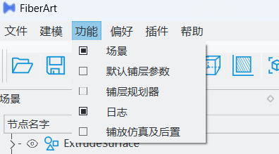

### 工具栏

工具栏中聚集了一些常用的功能，如打开/保存文件、三维显示视角控制、三维球等。当鼠标悬停在对应图标上时，会出现文字注解。

### 浮动窗口布局

FiberArt软件会把功能类似的交互放置在一个子窗口中，所有的子窗口支持拖动、调整大小等功能，用户可以自由的布局整个软件。

鼠标悬停在不同窗口的交接处，可以拖动窗口大小；鼠标在窗口的标题处单击并按住，可以拖动窗口到不同的停靠区域，用户只需要根据自己的喜好将布局设置一次，下次软件打开会自动恢复该布局。

## 曲面铺放路径规划示例

下面通过一个实际的曲面铺放路径规划示例来演示软件的相关功能。

1. 点击工具栏打开按钮，在弹出的*选择文件*对话框中，将右下角的文件类型过滤选择为*CADSolidShell*，然后选择安装目录下的*share/Data/Surfaces/ExtrudeSurface.stp*文件
   
    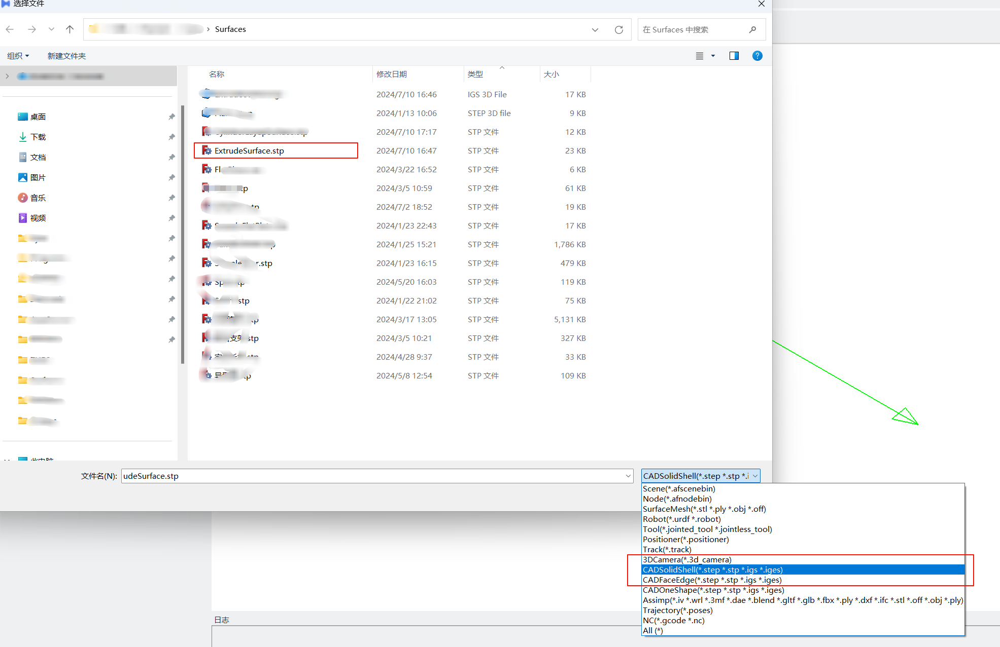

2. 在菜单栏点击*功能*，在下拉菜单中勾选*铺层规划器*
   
    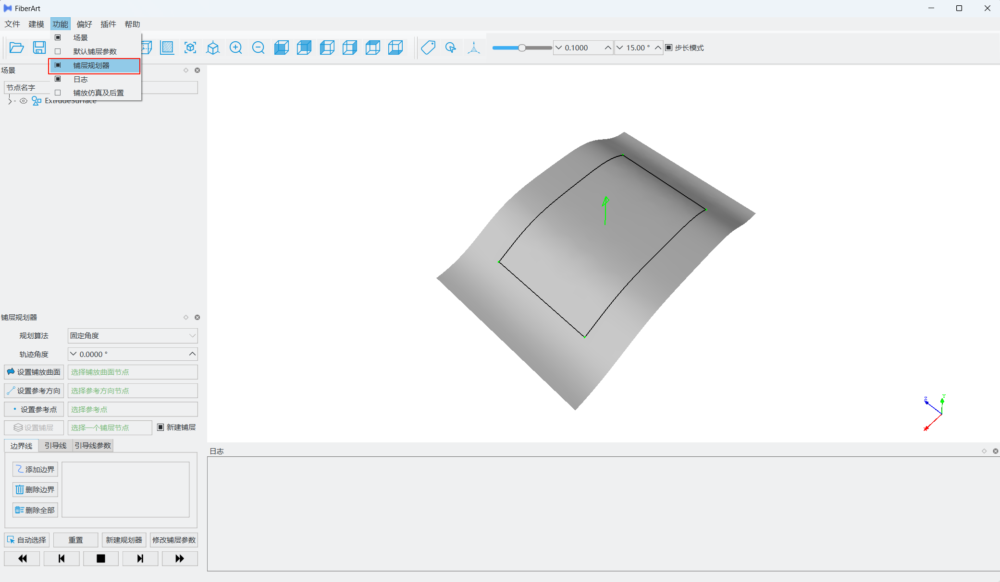

3. 点击场景树中的节点左侧的*>*，展开场景树 
   
    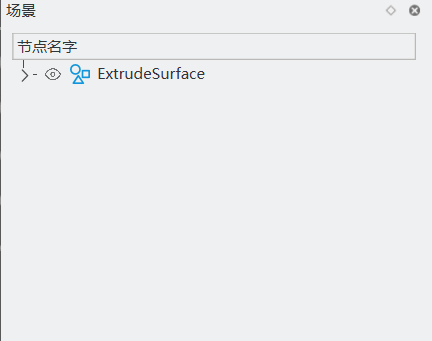 

4. 点击场景树中的*Shell1*，然后点击铺层规划器中的*设置铺放曲面*
   
    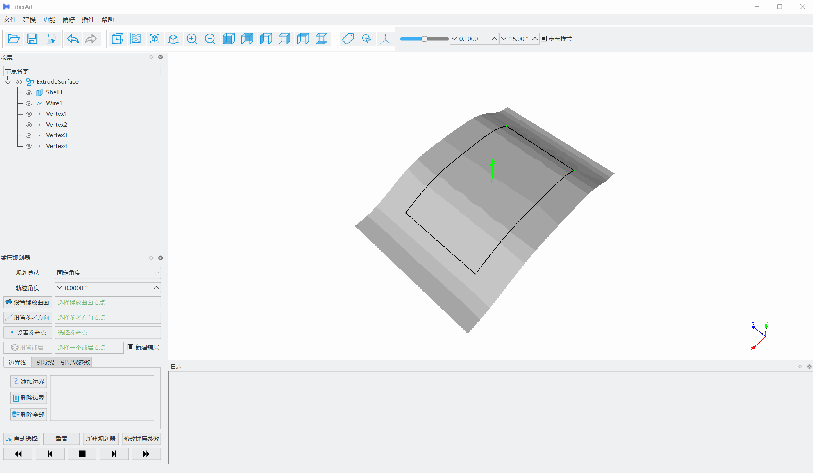

5. 点击菜单栏*建模*，在子菜单中选择*线段*，在子菜单中选择*Z方向线段*
   
    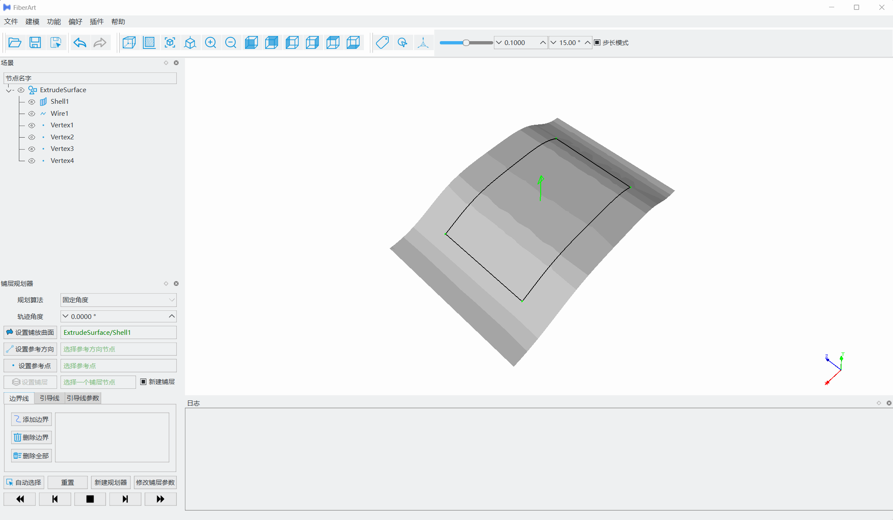

6. 在场景树中选择*SegmentZ*，然后点击铺层规划器中的*设置参考方向*
   
    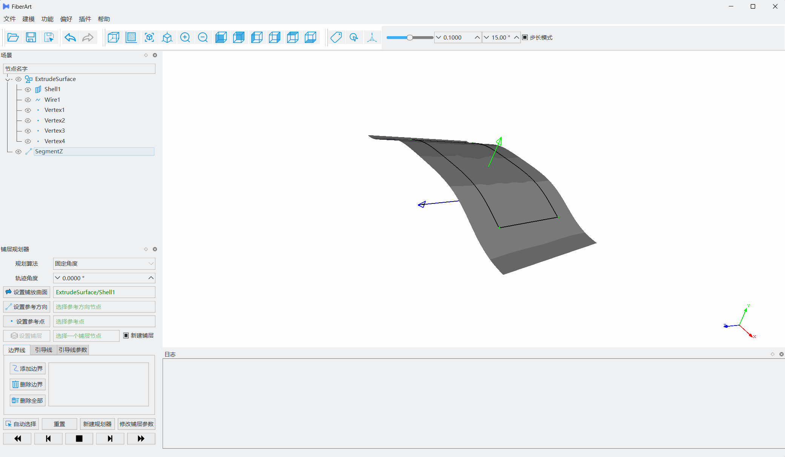

7. 创建一个参考点，并设置到铺层规划器，在菜单栏的建模中选择点，然后在3D窗口中，使用鼠标点击曲面上一点，然后在场景树的*Point*节点上右击，在弹出的菜单中，选择其他，拾取点
   
    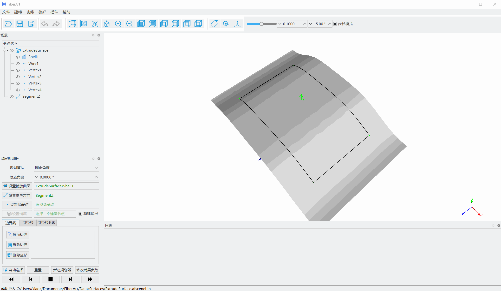

8. 选择创建的*Point*节点，在铺层规划器中点击*设置参考点*
   
    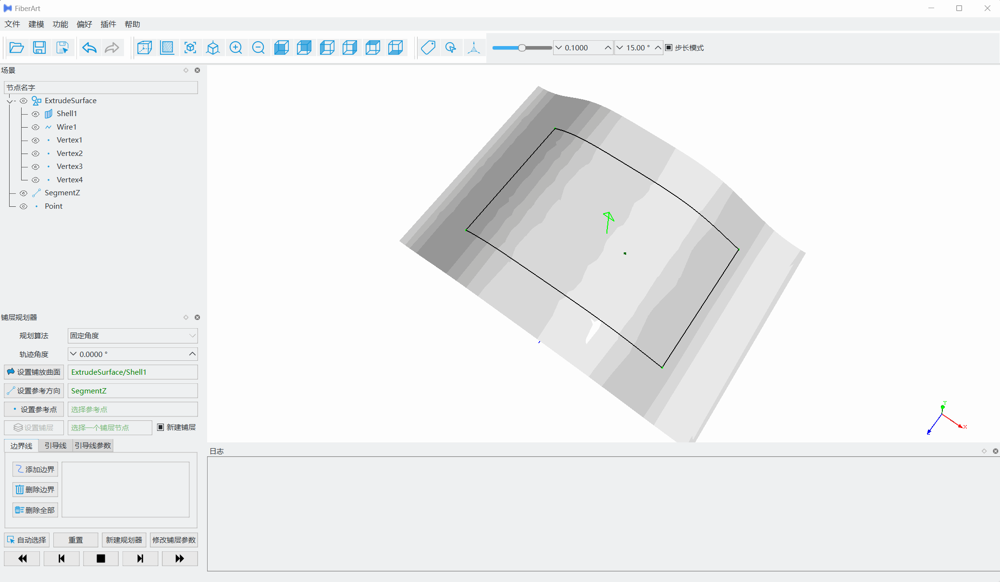

9. 在场景树中选择*Wire1*，然后在铺层规划器中点击*添加边界*

    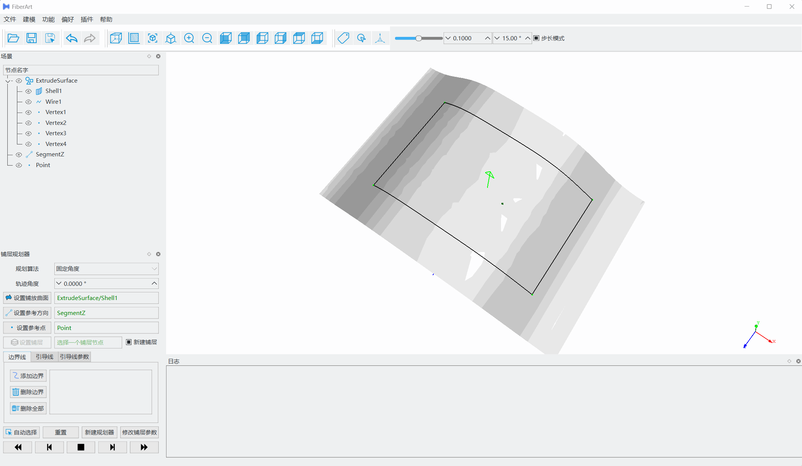

10. 点击铺层规划器中*新建规划器*

    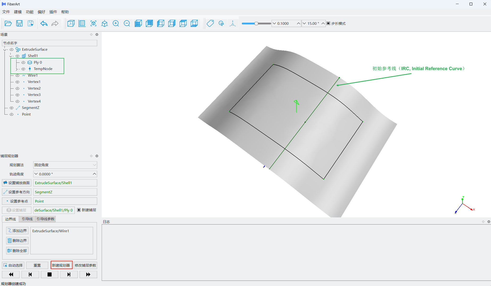    

11. 点击*向右规划至边界*
    
    

12. 点击*向左规划至边界*

    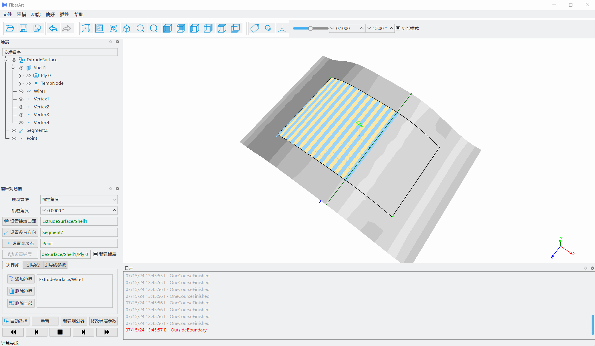

13. 该0°铺层已经完成，在场景树中隐藏*Ply 0*和*TempNode*节点

    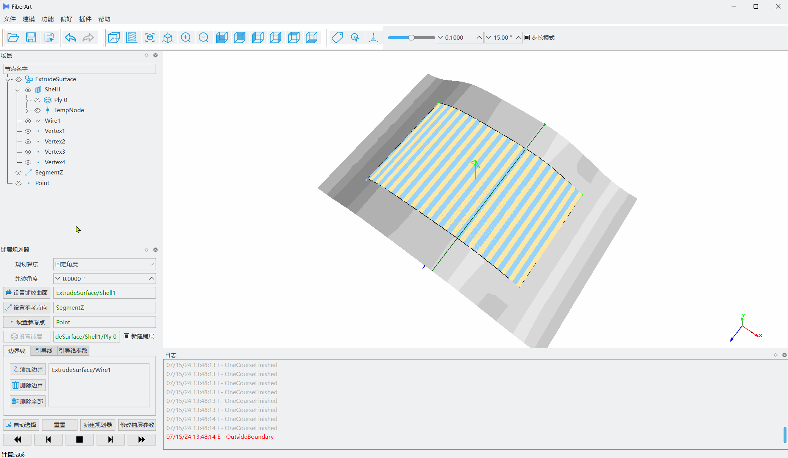

14. 在铺层规划器中修改轨迹角度为45°，重新*新建规划器*，然后分别*向左/右规划至边界*

    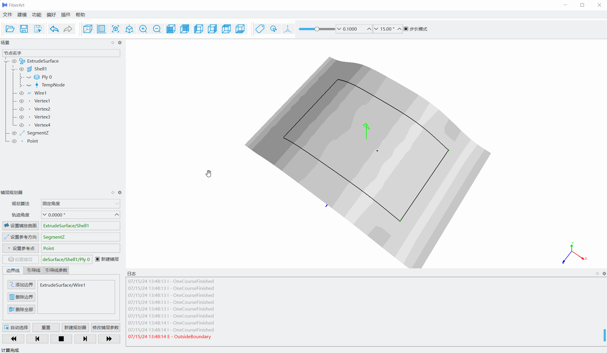

15. 保存文件，点击工具栏中的保存按钮，在弹出的对话框中选择保存的位置和文件名称。

## 规划注意事项

以上是一个常规的曲面铺放路径规划流程，以上步骤可以大致分为：1. 导入CAD模型；2. 设置规划参数；3. 实施规划；4. 保存规划结果。

在规划完成之后，进一步对规划的轨迹进行[仿真与后处理](./simulation.md)，最终生成可以由铺放设备运行的数控程序或者机器人程序。

### 规划参数设置
在上述过程中，我们仅涉及到必要的设置步骤，其他都采取了默认的参数设置，实际规划中，我们可能需要修改很多参数，比如铺放根数、剪切距离等等，这些参数可以在*Ply*的属性编辑中进行设置，详细的参考[规划参数设置](./ply_planner.md)。

### 曲面处理

如果导入的模型是step、iges格式，软件会使用默认的参数及算法自动将其转化为三角网格结构，这对于大多数简单的模型（平面、圆柱等规则类）可以满足要求。但是一些复杂曲面建议用户按照下述步骤，先设置合理的转换精度和算法，再进行手动转换。

1. 双击`Shell1`节点，右侧弹出`Shell1 属性`面板；
2. 在`曲面离散`中选择`默认`，设置线性偏差、角度偏差等参数，一般建议线性偏差选择0.0001~0.001m左右，具体偏差可以根据模型尺寸改变，模型尺寸越大，偏差应该也稍微大一点；角度偏差一般5~10°；
3. 如果曲面模型是由很多面组合形成的，且存在一些很小的面以及可能存在很小的缝隙等缺陷，设置`曲面缝合误差`的值为一个合适的数值，算法将会努力尝试修补这些缺陷，得到一个更好的三角网格结构；如果曲面不存在上述问题，请将`曲面缝合误差`设置为0，以跳过对应的步骤，节省计算时间；
4. 点击计算，生成网格结构，可能会需要一些时间；

计算完成后，在场景树中增加了 `Shell1|Meshed` 的节点，隐藏原有的`Shell1`节点以避免显示重叠问题，双击`Shell1|Meshed`节点，会弹出该节点的属性编辑器，可以对Mesh进行一些基本操作，比如反转法线、导出、偏移、投影曲线和点到Mesh等。

