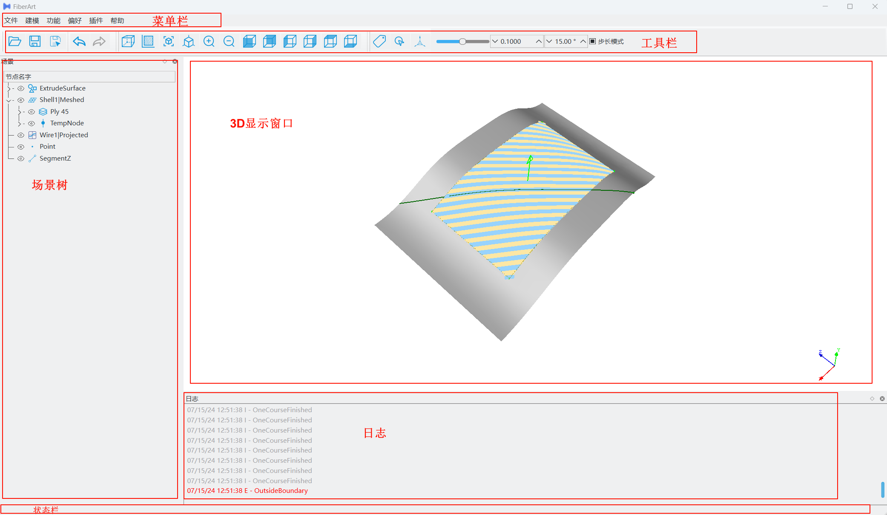
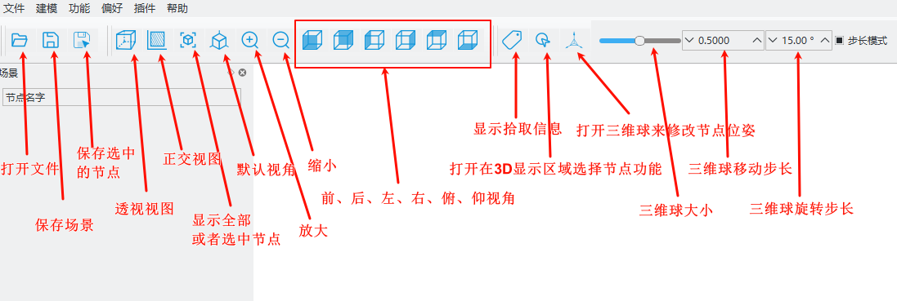

# 快速上手教程 (Getting Started)

## 软件界面
初次打开软件，显示的界面如下图所示：

### 工具栏

工具栏中聚集了一些常用的功能，如打开/保存文件、三维显示视角控制、三维球等。当鼠标悬停在对应图标上时，会出现文字注解。

### 浮动窗口布局

FiberArt软件会把功能类似的交互放置在一个子窗口中，所有的子窗口支持拖动、调整大小等功能，用户可以自由的布局整个软件。

鼠标悬停在不同窗口的交接处，可以拖动窗口大小；鼠标在窗口的标题处单击并按住，可以拖动窗口到不同的停靠区域，用户只需要根据自己的喜好将布局设置一次，下次软件打开会自动恢复该布局。

## 打开文件

可使用三种方式：

- 点击菜单栏 `文件` 按钮，展开下拉菜单，单击`打开`
  

- 点击工具栏的 `打开` 图标

- 通过快捷键 `Ctrl+O` 打开文件

> 注意：软件中某一按钮如果提供了快捷键，都会标注在该按钮的文字旁边；使用快捷键时，需要将输入法切换到英文，不然无法正常工作。

### 文件对话框

在弹出的打开文件对话框中：

- 导航到`FiberArt安装目录/share/Data/Surfaces`
- 将文件类型过滤器设置为`CADSolidShell(*.step *.stp *iges *.igs)`
- 选择要打开的`SamplePanel.stp`文件，双击该文件或者点击`打开`按钮即可打开该文件。

## 模型处理

展开场景，可以看到模型中包含的曲线、曲面等节点。这里我们只关心和路径规划相关的节点，暂时删除其他节点。每个节点用从根节点到当前节点的路径表示，比如`SamplePanel/layup surface`表示铺放表面。

### 删除节点
保留`SamplePanel/A-10-FiberArt`和`SamplePanel/layup surface`，删除其他节点。

> 删除节点可以选中节点，然后右击，在弹出的快捷菜单中选择`删除`，或者选中节点后直接按键盘上的`Del`键。

### 改变透明度

在3D显示区域，因为`A-10-FiberArt`曲线和曲面是重合的，所以在不同的视角下，曲线的一些部分可能会显示不出来，此时可以将铺放曲面设置为半透明状态，来避免显示冲突。

在`layup surface`节点上右击，在弹出的快捷菜单中点击`改变透明度 T`，或者选中节点后，在键盘上按`T`（注意输入法必须切换到英文），节点将在透明/半透明状态自动切换。

点击场景管理界面的空白区域取消选择，或者选中节点后直接按键盘上的`Esc`键取消选择。取消选择后，节点由高亮状态回到正常显示状态。

## 添加参考点、线

在菜单栏选择`建模`，在弹出的菜单中点击`点`，新建一个参考点节点；点击`线段`，再点击`X方向线段`，新建一个和坐标系X轴方向平行的线段节点。

### 拾取点

在3D窗口中，点击铺放边界内路径规划的起始点，然后在场景界面右击参考点节点，在弹出的快捷菜单中，点击`其他`，在子菜单中点击`拾取点`，参考点的位置将设置为刚刚在模型上拾取的点。

> 提示：点击3D窗口，激活鼠标，按住`Alt`键，鼠标可由手型变为指针，方便更加精确的拾取。

## 路径规划

点击菜单栏的功能选项，在弹出的子菜单中，勾选`铺层规划参数`、`铺层规划器`，在铺层规划参数界面中设置、改变对应设备的参数，如铺放头最大可铺放带数量、剪切距离等，详细内容请参考[铺层规划参数](./plan_parameters.md)。

- 在铺层规划器界面中，设置要采用的规划算法、路径角度；
- 在场景界面选中`layup surface`节点后，在铺层规划器界面中点击`选择铺放曲面`按钮，使用同样的方法依次设置参考方向为`SegmentX`节点，参考点为`Point`节点；
- 在场景界面选择`SamplePanel/A-10-FiberArt`曲线节点，在铺层规划器界面，单击`添加边界`按钮；
- 点击`新建规划器`，将会显示初始的参考曲线（IRC，Initial Reference Curve）；
- 点击，将会规划到右侧边界；
- 点击，将会规划到左侧边界；

 
  
> 类似暂停、播放那一排的按钮分别是： 
> - 向左规划到边界
> - 向左规划一组
> - 停止规划
> - 向右规划一组
> - 向右规划到边界

### 场景保存

点击工具栏的 `保存` 图标，在弹出的文件对话框中选择要保存的文件路径和名称，点击`保存`。该功能会保存整个场景树中的所有内容；如果只想保存单个节点，可以选中节点后，点击工具栏中的 `保存节点` 图标。

### 显示铺放路径

在铺层规划器界面点击`显示铺放路径`，可显示压辊的铺放路径。

## 后处理

在`菜单栏`的`插件`选项中，勾选`后处理`，在`后处理`界面中：

- 设置铺层节点
- 选择后处理程序
- 设置导出路径等
- 然后单击运行

不同设备可能需要对后处理程序进行一定程度的修改，定制化开发后处理脚本，相关信息请联系软件开发者。