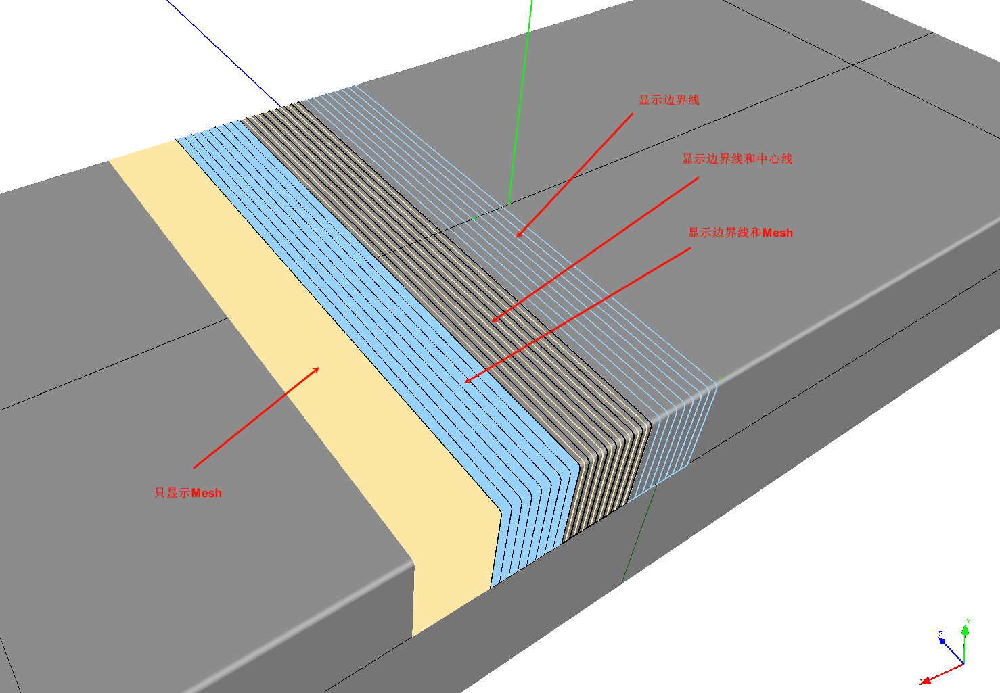

# 全局参数

## CAD 模型导入设置

- 导入单位：step/iges模型的导入单位，默认为米（M）;
- 线性偏差：模型显示Mesh的线性偏差；
- 角度偏差：模型显示Mesh的角度偏差；
- 相对表面偏差：相对偏差；
- 曲线偏差：导入曲线时的显示偏差；

## 铺层显示

- 显示单根带中心线：显示单根预浸带中心线；
- 显示单根带边界：显示单根预浸带的边界线；
- 显示单根带Mesh：显示预浸带的Mesh；

    以下是不同设置的显示效果图：
    

- 生成TowMesh采样点数：计算TowMesh时，在边线上的采样点数量，2表示自动计算；
- 边界线宽度：预浸带边线显示的线宽；
- Tow网格简化角度阈值：简化TowMesh的角度阈值；
- Tow网格嘉华距离阈值：简化TowMesh的距离阈值，这两个值用来简化显示的Mesh，应该根据模型尺寸合理设置；
- Tow中心线计算步长：如名；
- 预浸带颜色1：预浸带的颜色；
- 预浸带颜色2：另一组预浸带颜色；
- Tow网格厚度偏移：为了避免预浸带显示和模型重叠，将预浸带向上偏移给定的距离；
  
## 三维球最大尺寸

用来移动、旋转物体坐标的三维球（gizmo）最大尺寸；

## 突出显示

用来设置某个节点被鼠标选中或者悬停时突出显示的风格。

- 选中颜色：节点被选中时的颜色；
- 悬停颜色：鼠标在节点上悬停时的颜色；
- 加粗线宽：如果选中的是曲线类型，将曲线线宽加粗多少进行突出显示；
- 增大点尺寸：如果选中的是点类型，将点的显示尺寸增加多少；

## 点选

用来设置是否开启鼠标直接在3D显示区域进行物体选择；开启3D点选可以提供一定的便捷性，但是影响性能，有时也带来一定的干扰和误操作。

## 界面

- 语言：界面语言设置，一般情况下无需在此进行设置，而应该在 `偏好/语言`菜单中进行设置，然后重启可以进行完整的语言改变。
  
## 路径参数

- 相交路径最小长度：计算路径交点时，如果路径长度已经很短，就将其近似为直线；
- 参数曲线计算采样步长：计算参数曲线时，在空间曲线上采样点的间隔；
- PathOnMesh路径偏差：将曲面上曲线投影到曲面（Mesh）上时，投影的线性误差，大于误差时，会进行迭代投影；
- 参数曲线过滤误差的平方距离指数：参数曲线相邻点精度
- 默认Mesh参数化方法：参数化Mesh时，采用的默认算法，当默认算法计算失败时，会自动尝试试用其他算法，所以默认算法可以看作是优先使用的算法：
    - ARAP：适用于可以展开成2D平面的3D曲面，投影拓扑为其展开的平面形状，该算法的计算时间可能会更久一些；
    - FloaterMeanValueCoordinates：适用于大多数情况，投影拓扑为盘形；
    - 其他：以上不适用的时候可以尝试；

## 规划参数

- 计算覆盖率的采样点数：计算铺层覆盖铺放区域的百分比时，在模型上采样的点的数量，采样数越高计算越准确，同时计算时间越长。

!!! tip  "提示"
    计算覆盖率，理论上等于铺放区域边界内的预浸带面积除以铺放区域的面积，但是铺放区域的边界可能是不规则的自由曲线，难以直接计算该铺放区域的面积。为了解决这个问题，采用概率的方法进行估算。在曲面上采样N个点，其中在铺放区域内的数量是M个，同时在铺放区域内和预浸带区域内的数量是L个，那么覆盖率便是 $\frac {L}{M}$，该方法还可以同时估算铺放区域的面积等。