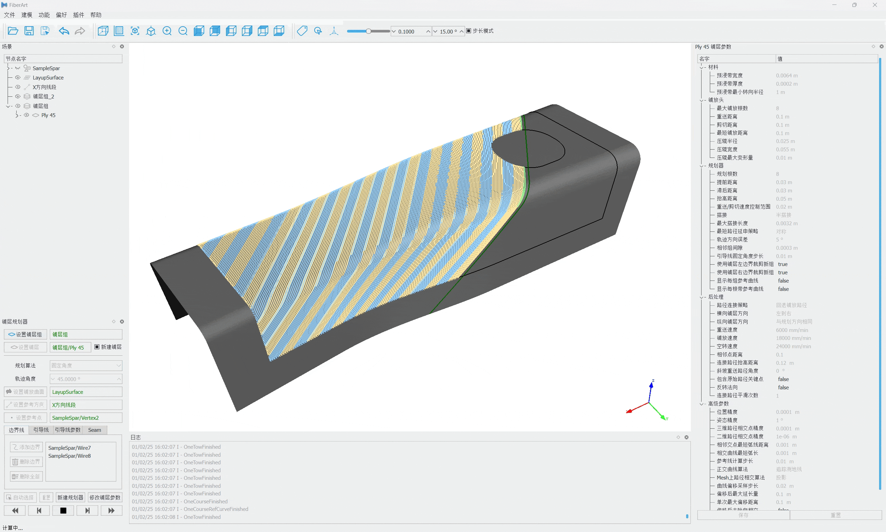

# FiberArt Automated Fiber Placement Software

## Introduction

**FiberArt** is an independently developed trajectory planning and simulation software for Automated Fiber Placement (^^AFP^^), featuring simple operation, comprehensive functionality, and excellent performance!

A trial version is currently available; please visit the **[Trial Application](./trial/index.md)** page to apply.

{ data-title="FiberArt trajectory planning for C-spar parts" width=75% }
///caption | >
FiberArt trajectory planning for C-spar parts
///

{ data-title="FiberArt simulation for C-spar parts" width=75% }
///caption | >
FiberArt simulation for C-spar parts
///

## Software Features

- Calculate placement trajectories based on user-imported CAD models
- Support various algorithms such as fixed angle, parallel curves, circumferential winding, etc.
- Set various layup parameters
- Support manual adjustment of placement trajectories
- Support various equipment types, such as robots (including linear tracks and positioners) and machine tool types
- Visualization of simulation results
- Export NC programs in G-code, KRL, and other formats

## Software Highlights

- **Comprehensive Functionality**: Includes complete trajectory planning, ply editing and analysis, multi-axis simulation, custom post-processing, etc. It does not limit workpiece or equipment types and offers strong versatility—from simple planes to complex surfaces with openings, and from single-robot/gantry systems to multi-axis redundant systems with additional rotary tables or tracks.
- **Superior Performance**: Benefits from late-mover advantage in software development, utilizing advanced technologies and algorithms in human-computer interaction, geometric computation, and geometric modeling to deliver efficient performance, reliability, and a user-friendly interface.
- **Independent and Controllable**: No need to install additional commercial software like CATIA; CAD models can be imported via the universal STEP format.
- **Customization on Demand**: Special customization can be provided based on customer functional requirements.
- **Proven in Practice**: Has been field-tested and applied in placement equipment for related projects.
