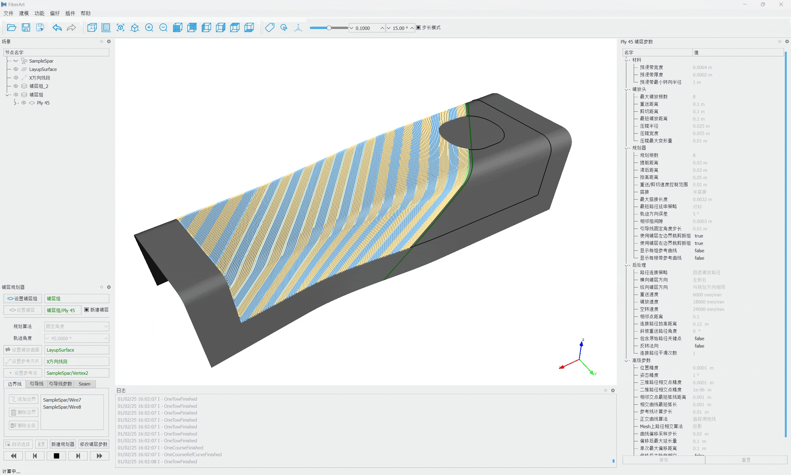

# FiberArt 自动铺丝软件
## 基本介绍
**FiberArt** 是国产自主开发的用于自动铺丝机（^^AFP^^， Automated Fiber Placement）的轨迹规划及仿真软件，操作简单，功能完整，性能卓越！

软件目前可试用，请前往 **[试用申请](./trial/index.md)** 页面进行申请。

{ data-title="FiberArt 软件C型梁类零件的铺丝轨迹规划" width=75% }
///caption | <
FiberArt 软件C型梁类零件的铺丝轨迹规划
///

{ data-title="FiberArt 软件C型梁类零件的铺丝仿真" width=75% }
///caption | <
FiberArt 软件C型梁类零件的铺丝仿真
///

## 软件功能
- 根据用户输入的CAD模型计算铺丝轨迹
- 支持多种算法，如固定角度、平行曲线、环向缠绕等
- 设置各种铺层参数
- 支持手动调整铺丝轨迹
- 支持各种类型设备，如机器人（包括导轨、变位机）、机床式
- 仿真结果可视化
- 可导出G代码、KRL等格式的数控程序

## 软件特点
- 功能完整：包含完整的轨迹规划、铺层编辑及分析、多轴仿真、自定义后处理等功能，不限制工件类型和设备类型，有很强的通用性，从简单平面到复杂开孔曲面零件，从单机器人式、龙门式到附加转台、导轨的多轴冗余系统，都可以胜任
- 性能优越：软件开发上具有后发优势，采用人机交互、几何计算、几何建模领域更先进的技术、算法，带来更高效的运行性能、可靠性以及友好的操作界面
- 自主可控：不需要额外安装Catia等其他商业软件，通过通用的step格式进行CAD模型导入
- 按需定制：可基于客户的功能需求进行特殊定制
- 实际检验：在相关项目的铺丝设备中已经经过实际的检验和应用
