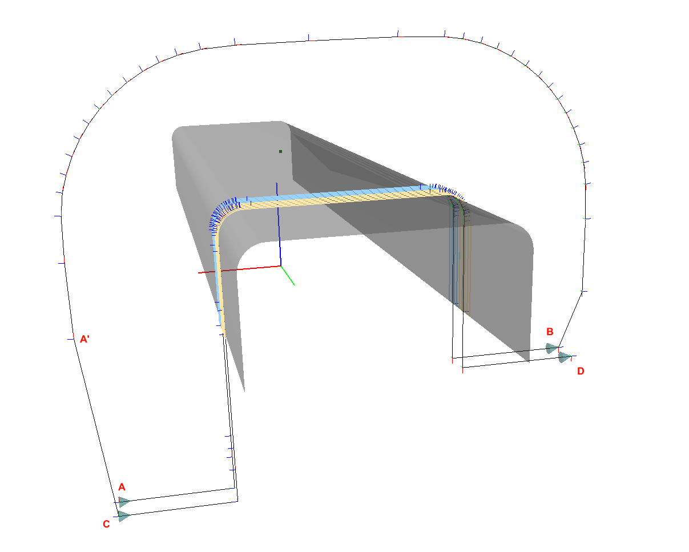
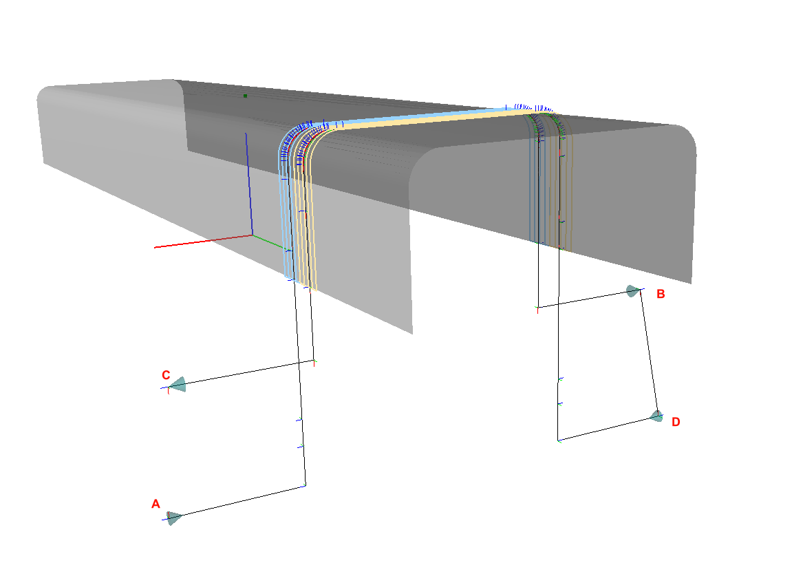
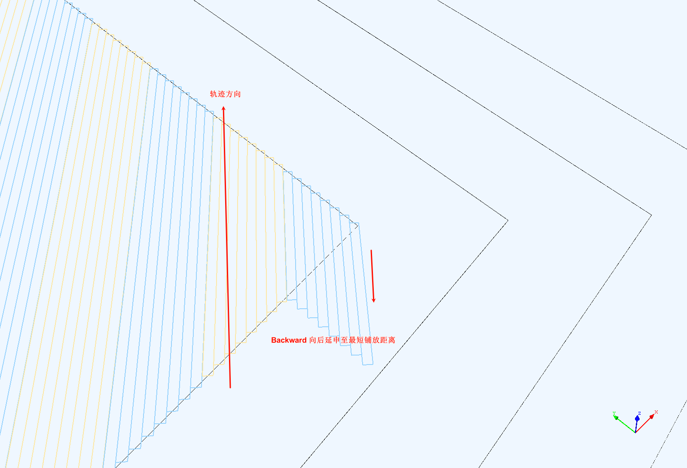

# 铺层规划参数

## 铺放路径定义

为了更加直观地说明铺层参数，以下面平板铺放的一条路径为例，来说明一些关键参数：

图中1-12定义了一条典型的铺放头路径的关键点，两个关键点之间的区间是关键区间，对于不同区间的距离、速度都有参数进行设置。

### 关键点定义
- 1: 接近芯模表面的点（Approach），也是路径起点； 
- 2: 接触芯模表面的点（Contact）；
- 3: 减速点（Deceleration）；
- 4: 重送点（Restart），R字母后面的数字表示要重送的预浸带；
- 5: 进入铺放区域边界(PlyStartBoundary)；
- 6: 加速点（Acceleration），压辊压紧预浸带后开始高速常规铺放；
- 7: 减速点（Deceleration），临近剪切位置，开始低俗铺放；
- 8: 剪切点（Cutting），C字母后面的数字表示要剪切的预浸带；
- 9: 加速点（Acceleration），剪切完成后，开始高速常规铺放；
- 10: 离开铺放区域边界(PlyEndBoundary)；
- 11: 准备离开芯模表面的回退点（Detach）；
- 12: 离芯模表面上方一定距离的回退点（Depature），也是该条路径的终点；
  
上述关键点的位置由下面的`区间定义`给定的参数计算得到。

### 区间定义 {#range-definition}
- 1-2，11-12：端点抬高距离；
- 2-4：提前距离；
- 4-5：重送距离；
- 8-10：剪切距离；
- 3-4，5-6，7-8，8-9：重送/剪切速度控制范围；

!!! attention  "注意"
    重送/剪切速度控制范围应该小于2-4提前距离和8-10剪切距离

- 10-11：滞后距离；

### 速度定义
- 重送速度：3-6、7-9区间的速度；
- 铺放速度：6-7，9-11区间的速度；
- 空转速度：其余区间的速度（1-3，11-12等）；

## 路径连接策略 {#link-path-policy}

每组预浸带的中心线是其铺放路径（也称为Head Path，铺放头路径），上一组铺放路径的终点和下一组铺放路径的起点之间的过渡路径如何计算，这便是路径连接策略要解决的问题，软件中内置了三种策略。

#### 直线 Straight

该策略下前一组路径的终点和下一组路径的起点使用直线连接。

该策略计算简单，可发挥最大的机器人运动性能，但仅适用于平坦曲面，不然连接路径可能会与模型碰撞。

#### 直线投影 StraightProject

该策略下前一组路径的终点和下一组路径的起点使用直线连接，但是会将该直线投影到铺放曲面上，然后再沿着每点的法向进行偏移，一定程度上避免与铺放曲面的碰撞，同时也可以产生较短距离的连接路径，提高运行效率。

#### 回退铺放路径 ReverseCurrentHeadPath

该策略下，铺放头运动到路径终点以后，将刚刚的铺放路径反向，同时朝着曲面的法向偏移一定的距离（该距离由`后处理参数/空行程抬高距离`定义）生成一条平行于原始铺放路径的过度连接路径；在该路径上按照给定的间隔采样（由`后处理参数/空行程路径点距离`定义），达到临近下一组铺放路径起点的位置，然后再以直线插补运动过去。

以下例子假设 `A-B`、`C-D`分别是相邻的两组铺放头路径。

上图中，使用`Straight`策略，路径是`A-B-C-D`，会导致过度路径从梁的下侧直线穿过（**B-C**段），不可避免地导致碰撞。

上图中，使用`ReverseCurrentHeadPath`，路径是`A-B-A'-C-D`，过度路径会绕着梁的铺放路径先回退回来(**B-A'**段)，再运动到下一组路径起点（**A'-C**段）。

该策略适用于回转类零件的90度、±45度铺放路径。

#### 双向铺放 ReverseNextHeadPath

上述的`Straight`和`ReverseCurrentHadPath`都受限于铺放头只能*单向铺放*的约束。如果铺放头可以**双向铺放**，应该使用`ReverseNextHeadPath`的连接策略，该策略会将下一组铺放路径反向，一般情况下，这会使得上一组路径的终点和下一组路径的起点空间位置足够接近，可以直线运动过去。

双向铺放时，路径是`A-B-D-C`，过度路径是`B-D`，下一组路径原本方向应该是`C-D`，反向为`D-C`，从而实现双向铺放。

使用双向铺放可以提高效率，但是铺放设备应具有相应的功能，且对运动精度要求比较高。

## 参数说明

!!! note
    FiberArt中长度单位统一为**米（m）**。

### 材料
- 预浸带宽度：预浸带（Tow）的宽度，典型值是0.0064m (1/4 inch)；
- 预浸带厚度：预浸带的厚度；
- 预浸带最小转向半径：预浸带在平面弯曲铺放的最小转向半径；

### 铺放头
- 最大铺放根数：铺放头一组（Course）最大可以铺放多少根预浸带，典型值如4、8、16、32等；
- 重送距离：参见[区间定义](#range-definition)
- 剪切距离：参见[区间定义](#range-definition)
- 最短铺放距离：铺放头可以铺放的最短预浸带长度，通常与重送距离、剪切距离接近；
- 压辊半径：铺放头压辊的半径；
- 压辊最大变形量：铺放头压辊的最大变形量；

### 规划器
- 规划根数：每一组（Course）规划的预浸带数量；

!!! attention "注意"
    **规划根数**必须小于等于**铺放头最大铺放根数**。

- 提前距离：参见[区间定义](#range-definition)
- 滞后距离：参见[区间定义](#range-definition)
- 抬高距离：参见[区间定义](#range-definition)
- 重送/剪切速度控制范围：参见[区间定义](#range-definition)
- 搭接：相邻两组预浸带的搭接方式；
    - No：不允许搭接，相邻两组预浸带不会有搭接重叠，但间隙可能较大；
    - Half：半搭接，允许相邻两组边界预浸带进行搭接重叠，直至重叠距离超过预浸带一半的宽度；
    - Full：完全搭接，允许相邻两组边界预浸带进行搭接重叠，直至重叠距离超过预浸带的宽度；
    - Ignore：不计算相邻两组边界预浸带是否搭接，只使用铺放区域边界进行裁剪；
- 最短路径延申策略：在计算拐角等处45度方向的轨迹时，边界内的丝束长度往往达不到最短铺放距离，此时需要对此丝束进行延申：
    - Symmetric: 沿着两端以对称延申，这是默认选项
    

    - Backward：向轨迹方向的反方向延申
    

    - Forward: 向轨迹方向延申
     

- 轨迹方向误差：使用固定角度算法规划时，允许路径方向偏离给定方向的范围，从而使有些路径可以直接使用偏移算法，减少空隙与搭接；
- 相邻组间隙：相邻两组预浸带的间隙（Gap between course and course）；

!!! note 
    理论上相邻两组是紧挨在一起的，但是引入一个较小的间隙，有助于实施不同的搭接策略，通常该间隙足够小，如0.1mm，不会导致实际的铺层产生缺陷。

- 引导线固定角度步长：在引导线上采样点的间距；
- 显示每组参考线：规划时，实时显示每一组预浸带的参考中心线；
- 显示每根参考线：规划时，实时显示每一根预浸带的边界、中线的参考线；

### 后处理参数
- 路径连接策略：参考[路径连接策略](#link-path-policy);
- 横向铺层方向：生成连接路径时，是从左向右铺放还是从右向左铺放；
- 纵向铺层方向：生成连接路径时，是否对规划的铺放路径方向进行逆转；
- 重送速度：重送段铺放头的运动线速度, mm/min;
- 铺放速度：正常铺放时铺放头的运动线速度, mm/min;
- 空转速度：过度轨迹铺放头的运动线速度, mm/min;
- 相邻点距离：铺放路径上采样间隔；
- 连接路径抬高距离：连接路径上点相对铺放表面的距离；
- 包含原始路径关键点：
- 反转法向：反转点的法向
- 连接路径平滑次数：对过度路径进行贝塞尔二阶平滑的次数，数值越高，过度路径应该会更加平滑，从而改进机器人运动性能；

### 高级参数

!!! attention "注意"
    以下参数，或者不常用，或者不建议普通用户进行修改（除非确切了解该参数的意义）。

- 位姿精度：计算两个由4x4矩阵表示的位姿是否相同的精度范围；
- 姿态精度：计算姿态是否相同的精度范围；
- 三维路径相交点精度：空间两条路径交点的计算精度；
- 二维路径相交点精度：平面两条路径交点的计算精度；
- 正交曲线算法：计算位于曲面里的曲线上某点正交于（垂直于）该点切方向的曲线的方法：
    * 追踪测地线 TracingGeodesic：自然曲线法
    * 固定角度测地线 FixedAngleGeodesic：固定角度法
    * 正交平面截断线 OrthogonalPlaneSection：由法平面与曲面的截线计算

- Mesh上路径相交算法：曲面里的曲线相交计算方法：
    - 投影 Project：投影计算
    - 直接 Direct：直接计算

- 曲线偏移采样步长：曲线偏移时，采样点的间隔；
- 偏移后最大延长量：曲线偏移后，向两端最大的延长长度；
- 单次最大偏移距离：沿正交曲线一次最大偏移量，使用较小的值，可以避免偏移后曲线产生的自相交问题；
- 使用基曲线计算参考线：使用Course的中心线的基路径计算下一条参考线，设置为false，可以提高计算速度，避免过度计算；设置为true，可以避免当前组中心线比较短导致下一组中心线计算误差较大的问题；
- 偏移后去除自相交：偏移曲线后，运行额外的算法来检测曲线是否有自相交；
- 偏移后去除折返线：偏移去先后，运行额外的算法来检测曲线是否有折返线；

## 如何修改铺层参数 {#how-to-modify-ply-parameters}

每一个单独的铺层都保存一份属于自己的独立的参数集，要修改某个铺层的参数：

- 在场景树中右击该铺层，在弹出的菜单中，选择“其他/修改参数”
- 双击该铺层打开它的属性面板，在**基础**面板下点击**修改铺层参数**，在弹出的界面中进行编辑修改;
- 如果正在规划，也可以点击规划器中**修改铺层参数**的按钮；

铺层参数编辑界面的标题栏会显示当前正在编辑的参数属于哪一个铺层，如果没有铺层，则显示编辑的是**默认铺层参数**。

创建新的铺层时，会从当前的铺层参数编辑器中复制一份参数集。