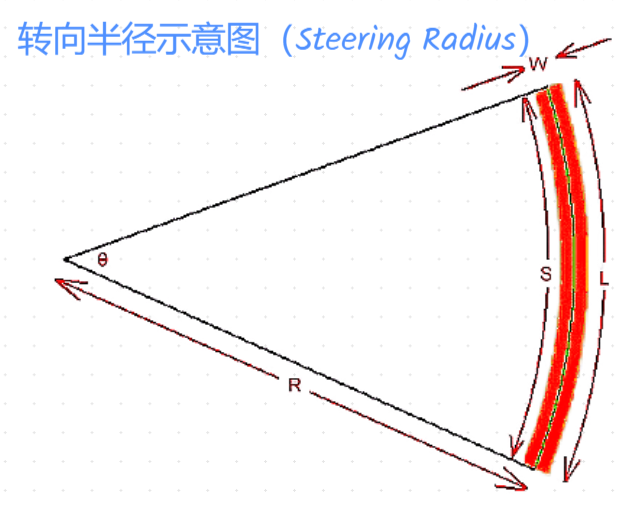
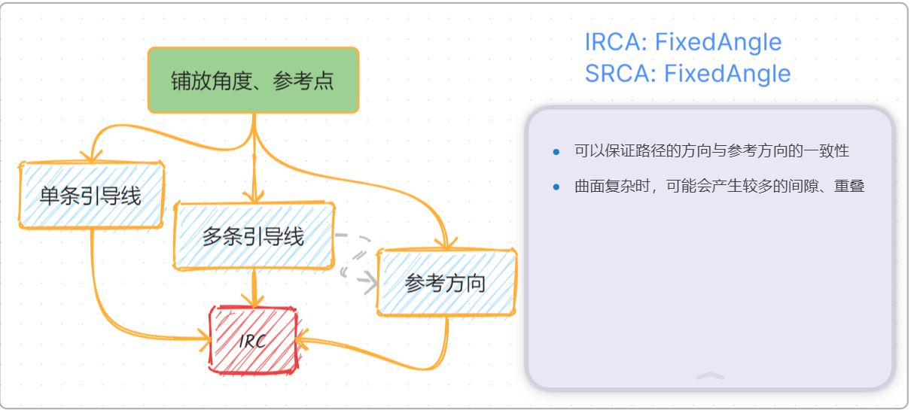
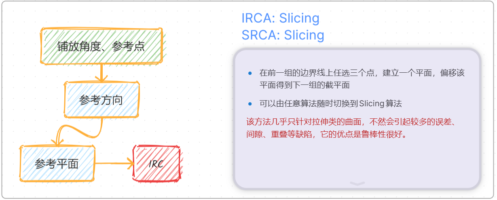
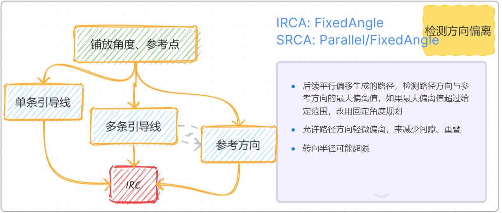
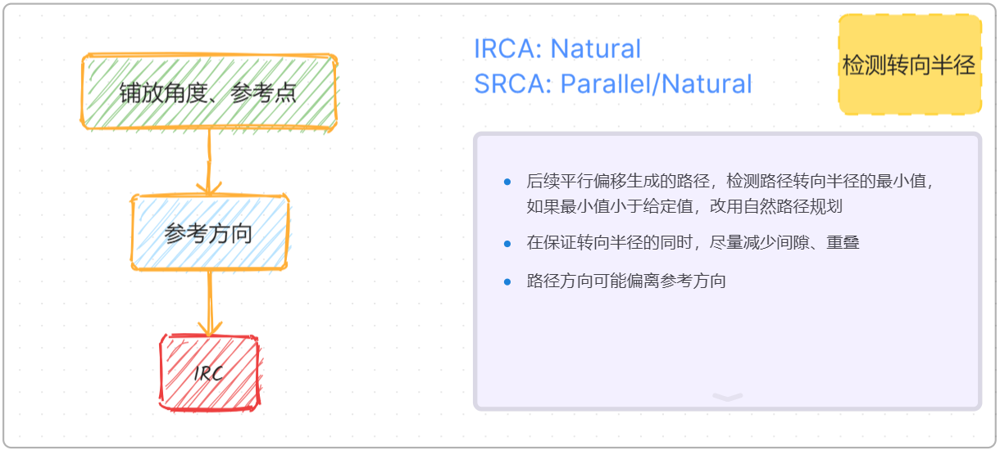

# 铺层规划器

## 铺层规划器界面简述

- 规划算法：选择使用哪种规划算法，下面有更加详细的说明；
- 轨迹角度：铺放轨迹方向与参考方向的夹角；
- 设置铺放曲面：从场景树中选择一个曲面节点，然后点击该按钮，设置待铺放的曲面，可选的节点是曲面或者Mesh网格；
- 设置参考方向：从场景树中选择一个线段节点，然后点击该按钮，设置路径的参考方向；
- 设置参考点：从场景树中选择一个点节点，然后点击该按钮，设置路径规划的起始点；
- 设置铺层：在`新建铺层`复选框没有勾选的时候，可以从场景树中选择一个已有的铺层继续规划，相关的参考曲面、参考方向、边界线等会从该铺层中读取，并覆盖现有设置；
- 新建铺层：新建一个铺层；
- 边界线：铺放区域的边界线：
- 引导线：路径的引导线，可以没有、一条或者多条；
- 引导线参数：多条引导线时，额外的参数选项；
    - 以单引导线为IRC：如果引导线只有一根，可以勾选次选项，直接将该引导线作为初始参考线，后续的预浸带都是由此引导线偏移曲线生成；
- 自动选择：在导入的场景中，由BFS（Breadth First Search, 广度优先搜索）算法，查找第一个Mesh、线段、点，作为对应的铺放曲面、参考方向、参考点；
- 重置：清空参考方向、点等设置；
- 新建规划器：由给定的规划算法、轨迹角度、参考方向、参考点、边界线、引导线等参数，构造一个新的规划器；任何以上参数改变后，都需要新建一个规划器，才会生效；
- 修改铺层参数：在创建规划器以后，可以修改所属铺层的铺层规划参数，参考[如何修改铺层参数](./plan_parameters.md#如何修改铺层参数)

## 一些术语解释

为了让用户知道如何选取合适的规划算法，对相关概念做一些简单解释。

- 自然曲线：预浸带自然贴合到曲面上形成的曲线，转向半径接近无穷大
- 引导线：附着在曲面上的曲线，为轨迹规划提供一定的方向参考
- 转向半径：预浸带铺放时左右转向引起中心线有曲率，该曲率半径为转向半径

软件采用如下算法计算转向半径：

$$
\begin{aligned}
L &= (R + \frac {W}{2}) \cdot \theta \\
S &= (R - \frac {W}{2}) \cdot \theta
\\ \implies 
R &= \frac {W\cdot(L + S)}{2\cdot(L-S)}
\end{aligned}
$$

- 轨迹角度：在预浸带中心线路径任意点的切平面，将参考方向投影到该平面，投影向量与该点切向量的夹角

## 参考线（Reference Curve, RC）
参考线指的是一组预浸带的中心线，平行偏移该中心线，可以得到组内其他预浸带的边界线。

### 初始参考线 （Initial Reference Curve, IRC）
初始参考线指的是规划一个铺层的路径时，待规划的第一组预浸带的参考线。

### 初始参考线算法（Initial Reference Curve Algorithm, IRCA）

参考线的计算多个参数有关系，根据输入的参数不同，可以分为下面几类：

#### 未定义引导线

此时需要定义参考点、参考方向、铺放角度，计算IRC有以下算法：

- FixedAngle, 固定角度，计算出来的参考线在铺放方向上没有偏离，但是在转向半径上可能小于最小值
- Natural，自然曲线，计算出来的参考线各处的转向半径趋于无穷大，但是在方向上可能偏离铺放方向
- Slicing, 切片，由给定的参数计算一个截平面（Section Plane），计算截平面和曲面的相交线，作为IRC

#### 定义了引导线

##### 单引导线
仅仅指定了一条引导线，IRC有以下两种算法：

- Off-the-shelf，直接使用现有的引导线作为IRC
- FixedAngle，此时需要定义参考点和铺放角度，计算出来的IRC各点的方向和引导线上最近点的方向相同

##### 多引导线
定义了多条引导线，采用FixedAngle计算IRC，需要同时指定参考点和铺放角度，计算出来的IRC各点的方向是各引导线上离该点最近的点的方向的加权值。

### 后续参考线算法（Subsequent Reference Curve Algorithm, SRCA）

计算其他组的参考线，可以使用：

- Parallel，平行偏移，偏移前一组的边界线得到当前组的参考线，偏移距离就是一组预浸带宽度的一半
- FixedAngle，类似于IRCA
- Natural，类似于IRCA
- Slicing，类似于IRCA

## 规划算法解释

了解以上概念之后，不同的规划算法就是不同的 **IRCA** 和 **SRCA** 的组合。

- 固定角度

- 平行偏移

- 自然曲线，类似于固定角度算法，只不过是每次先尝试使用平行偏移计算，如果检测转向半径过小，则改用自然曲线方法重新计算；

- 切片

- 固定角度-平行偏移

- 自然曲线-平行偏移

