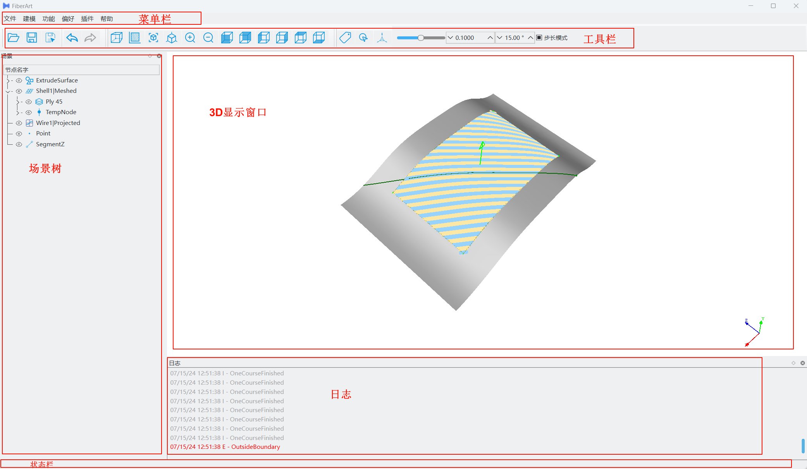
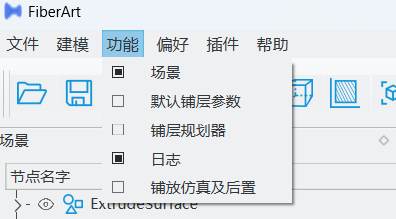
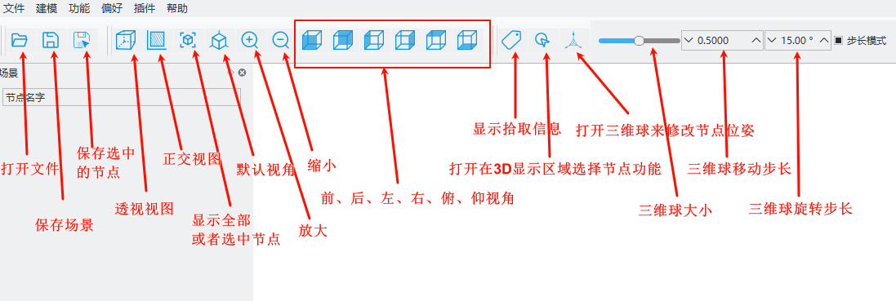
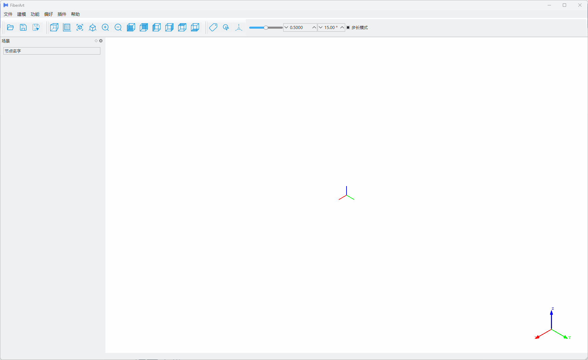

# Quick Start Tutorial

## Software Interface Basic Operations

When you first open the software, the interface shown below will appear:



### Menu Bar

The menu bar is the entry point for all software functions. Clicking each menu item opens a dropdown submenu. For example, functions such as planning and simulation can be displayed or hidden by clicking the *Function* option and checking the relevant checkboxes.



### Toolbar

The toolbar gathers commonly used functions, such as opening/saving files, 3D display view control, 3D gizmos, etc. Text tooltips appear when hovering the mouse over the corresponding icons.



### Floating Window Layout

FiberArt places interactions with similar functions into sub-windows. All sub-windows support dragging and resizing, allowing users to freely arrange the entire software layout.

Hovering the mouse over the boundary between different windows allows you to drag and resize them. Clicking and holding the title bar of a window allows you to drag it to different docking areas. Users only need to set the layout once according to their preference, and the software will automatically restore it the next time it opens.




## Planning and Simulation Modules

### Operational Logic

The operational logic for trajectory planning and simulation in FiberArt is shown in the following diagram:

```mermaid
flowchart LR
    subgraph Trajectory Planning
        direction TB
        A[Import CAD Model] --> B0[Select Planning Algorithm] --> B1[Set Placement Surface, Boundaries, Guide Curves, etc.] --> B[Set Equipment & Ply Parameters] --> D[Execute Planning]
    end

    subgraph Simulation & Post-processing
        direction TB
        E[Import Robot, Tracks, Placement Head, Workpiece, etc.] --> F[Adjust Part Positions, Build Simulation Environment]
        F --> G[Execute Simulation]
        G-->H[Select Post-processor] --> I[Output NC Programs like G-code]
    end

    n1([Start]) ==> Trajectory Planning ==> Simulation & Post-processing ==> n4([End])
```

### Trajectory Planning and Simulation Case for Wing Part

The following example demonstrates the software's relevant functions through a real curved surface path planning and simulation post-processing example.

<iframe src="//player.bilibili.com/player.html?isOutside=true&aid=114215931157250&bvid=BV1JzokYiEyo&cid=29041493012&p=1&autoplay=0&muted=0" 
scrolling="no" border="0" frameborder="no" framespacing="0" allowfullscreen="true" width="100%" height="400">
</iframe>


???+ note "Planning Parameter Settings"
    In the above process, we only involved the necessary setup steps, while others took default settings. In actual planning, we may need to modify many parameters, such as the number of tows, cutting distance, etc.
    These parameters can be set in the **Ply** attribute editor. For details, refer to [Planning Parameter Settings](./plan_parameters.md).

## Next Steps

Congratulations on completing a multi-layer fiber placement planning and simulation for a curved part using FiberArt.
If you still have questions about this case tutorial, please continue reading the rest of this documentation.
We suggest you proceed from [Ply Planning Parameters](./plan_parameters.md) to learn how to modify ply parameters to achieve the trajectories you expect.
