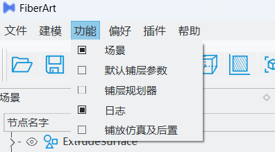

# 快速上手教程

## 软件界面基础操作
初次打开软件，显示的界面如下图所示：

### 菜单栏
菜单栏是软件所有功能的入口，单机每个菜单可以下拉打开子菜单，比如软件的规划、仿真等功能通过点击*功能*选项，勾选相关的复选框，可以显示或者隐藏对应功能的界面。

### 工具栏

工具栏中聚集了一些常用的功能，如打开/保存文件、三维显示视角控制、三维球等。当鼠标悬停在对应图标上时，会出现文字注解。

### 浮动窗口布局

FiberArt软件会把功能类似的交互放置在一个子窗口中，所有的子窗口支持拖动、调整大小等功能，用户可以自由的布局整个软件。

鼠标悬停在不同窗口的交接处，可以拖动窗口大小；鼠标在窗口的标题处单击并按住，可以拖动窗口到不同的停靠区域，用户只需要根据自己的喜好将布局设置一次，下次软件打开会自动恢复该布局。

## 规划及仿真模块

### 操作逻辑
FiberArt软件的轨迹规划及仿真的操作逻辑如下图所示：

### 机翼零件轨迹规划及仿真案例
下面通过一个实际的曲面路径规划及仿真后处理示例来演示软件的相关功能。

<iframe src="//player.bilibili.com/player.html?isOutside=true&aid=114215931157250&bvid=BV1JzokYiEyo&cid=29041493012&p=1&autoplay=0&muted=0" 
scrolling="no" border="0" frameborder="no" framespacing="0" allowfullscreen="true" width="100%" height="400">
</iframe>

!!!note "规划参数设置"
    在上述过程中，我们仅涉及到必要的设置步骤，其他都采取了默认的参数设置，实际规划中，我们可能需要修改很多参数，比如铺放根数、剪切距离等等，
    这些参数可以在 **铺层** 的属性编辑中进行设置，详细的参考[规划参数设置](./plan_parameters.md)。

## 下一步

恭喜您已经使用 FiberArt 软件完成了一个曲面零件的多层铺丝规划和仿真。
如果您对本案例教程中还有很多疑问，请继续阅读本文档的其余内容。
建议您从[铺层规划参数](./plan_parameters.md)继续，以了解如何修改铺层参数以达到您期待的轨迹。