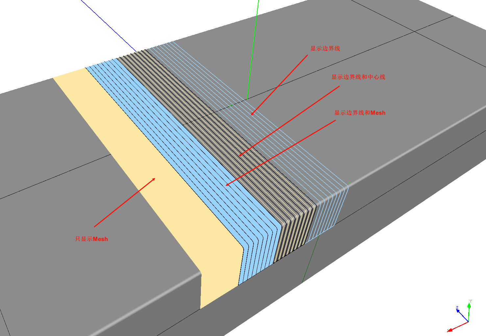

# Global Parameters

## CAD Model Import Settings

- Import Units: The import units for STEP/IGES models, default is meters (M).
- Linear Deviation: Linear deviation for surface discretization.
- Angular Deviation: Normal angular deviation for surface discretization.
- Relative Surface Deviation: Relative deviation.
- Curve Deviation: Display deviation when importing curves.
- Import Geometric Data Only: Only parses geometric data, does not read names, colors, etc.

## Ply Display

- Show Centerline of Each Tow: Displays the centerline of each prepreg tow.
- Show Boundary of Each Tow: Displays the boundary lines of each prepreg tow.
- Show Mesh of Each Tow: Displays the mesh of the prepreg tow.

    The following images show the display effects of different settings:
    

- Tow Mesh Sampling Points: The number of sampling points on the boundary lines when calculating the Tow Mesh; 2 means automatic calculation.
- Boundary Line Width: The line width for displaying prepreg tow boundaries.
- Tow Mesh Simplification Angle Threshold: Angle threshold for simplifying the Tow Mesh.
- Tow Mesh Simplification Distance Threshold: Distance threshold for simplifying the Tow Mesh. These two values are used to simplify the displayed mesh and should be set reasonably based on the model size.
- Tow Centerline Calculation Step: As the name implies.
- Prepreg Color 1: The color of the prepreg tow.
- Prepreg Color 2: The color of another set of prepreg tows.
- Tow Mesh Thickness Offset: To avoid overlapping the prepreg display with the model, the prepreg is offset upward by a given distance.
  
## Maximum Gizmo Size

The maximum size of the 3D gizmo used to move and rotate object coordinates.

## Highlighting

Used to set the style for highlighting a node when it is selected by the mouse or hovered over.

- Selection Color: The color of a node when selected.
- Hover Color: The color when the mouse hovers over a node.
- Bold Line Width: If a curve type is selected, how much to increase the line width for highlighting.
- Increase Point Size: If a point type is selected, how much to increase its display size.

## Click-to-Select

Used to enable or disable direct object selection by clicking the mouse in the 3D display area. Enabling 3D click-to-select provides convenience but can affect performance and sometimes introduce interference or accidental operations.

## Interface

- Language: Interface language settings. In most cases, this should not be set here, but rather in the `Preference/Language` menu, followed by a restart to fully apply the language change.
  
## Path Parameters

- Parametric Curve Calculation Sampling Step: The interval between sampling points on the spatial curve when calculating the parametric curve.
- PathOnMesh Deviation: Linear error for projecting a curve close to the surface onto the surface (Mesh). If the error is exceeded, interpolation iterations are performed.

## Planning Parameters

- Sampling Points for Coverage Calculation: The number of points sampled on the model when calculating the percentage of the placement area covered by the ply. Higher sampling numbers yield more accurate calculations but increase computation time.

!!! tip "Tip"
    Calculating coverage is theoretically equal to the area of the prepreg tows within the placement area boundary divided by the area of the placement area. However, the boundary of the placement area may be an irregular free-form curve, making it difficult to calculate its area directly. To solve this, a probabilistic method is used for estimation. Sample N points on the surface. If M points are within the placement area and L points are both within the placement area and the prepreg area, then the coverage rate is $\frac{L}{M}$. This method can also simultaneously estimate the area of the placement area, etc.
