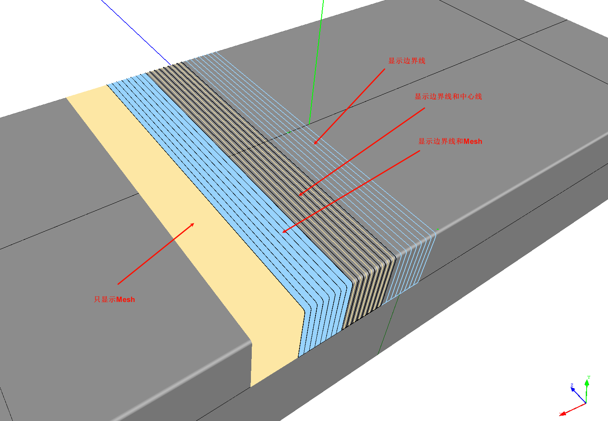

# Global Parameters

Global parameters are opened via the `Preferences > Global Parameters` menu. Click **Save** to apply changes, or **Reset** to restore defaults. The context menu also provides **Export / Import** for the whole parameter set.

## CAD Model Import Settings

- Import Units: The import units for STEP/IGES models, default is meters (M).
- Linear Deviation: Linear deviation for surface discretization.
- Angular Deviation: Normal angular deviation for surface discretization.
- Relative Surface Deviation: Relative deviation.
- Curve Deviation: Display deviation when importing curves.
- Import Geometric Data Only: Only parses geometric data, does not read names, colors, etc.

## Ply Display

- Show Centerline of Each Tow: Displays the centerline of each prepreg tow.
- Show Boundary of Each Tow: Displays the boundary lines of each prepreg tow.
- Show Direction of Each Tow: Shows placement direction arrows on the centerline of each tow.
- Show Mesh of Each Tow: Displays the mesh of the prepreg tow.

    The following images show the display effects of different settings:
    

- Tow Mesh Sampling Points: The number of sampling points on the boundary lines when calculating the Tow Mesh; 2 means automatic calculation.
- Boundary Line Width: The line width for displaying prepreg tow boundaries.
- Tow Mesh Simplification Angle Threshold: Angle threshold for simplifying the Tow Mesh.
- Tow Mesh Simplification Distance Threshold: Distance threshold for simplifying the Tow Mesh. These two values are used to simplify the displayed mesh and should be set reasonably based on the model size.
- Tow Centerline Calculation Step: As the name implies.
- Prepreg Color 1: The color of the prepreg tow.
- Prepreg Color 2: The color of another set of prepreg tows.
- Tow Mesh Thickness Offset: To avoid overlapping the prepreg display with the model, the prepreg is offset upward by a given distance.
  
## Maximum Gizmo Size

The maximum size of the 3D gizmo used to move and rotate object coordinates.

## Highlighting

Used to set the style for highlighting a node when it is selected by the mouse or hovered over.

- Selection Color: The color of a node when selected.
- Hover Color: The color when the mouse hovers over a node.
- Bold Line Width: If a curve type is selected, how much to increase the line width for highlighting.
- Increase Point Size: If a point type is selected, how much to increase its display size.

## Interface

- Default Pose Format: `GUI/DefaultPoseFormat` controls the default rotation format in pose editors and workpiece pose calibration. See [Poses and Calibration](../advanced/pose_calibration.en.md) for supported names and units.
- Independent Node Property Panel: When enabled, each node gets its own docked property panel, making it easy to compare parameters of multiple nodes at the same time; when disabled, all nodes share a single property panel.
- 3D Background Color 1: The first color of the gradient background in the 3D view.
- 3D Background Color 2: The second color of the gradient background in the 3D view.
- Gizmo Implementation: The implementation of the 3D gizmo. `FreeCAD` is the default implementation, `Legacy` is used to keep behavior compatible with older versions.

## Curve

- Intersection Distance Threshold: When computing whether two curves intersect, curves whose closest distance is below this threshold are treated as intersecting. Used by the `Compute Intersection` operation.

## Path Parameters

- Parametric Curve Calculation Sampling Step: The interval between sampling points on the spatial curve when calculating the parametric curve.
- PathOnMesh Deviation: Linear error for projecting a curve close to the surface onto the surface (Mesh). If the error is exceeded, interpolation iterations are performed.

## Planning Parameters

- Implicit Temp Node: Temporary nodes generated during planning (such as guide lines, reference lines, and temporary tows) are placed in the overlay layer of the 3D view by default, so they do not appear in the scene tree and are automatically removed when planning finishes; when disabled, temp nodes are added to the document as ordinary nodes.
- Show Reference Curve Direction: Shows direction arrows on the reference curve in the planning preview, making the placement direction easier to identify.

## Update

- Update Channel: Selects the version channel used for update checks. `Stable` is the official release channel, `Beta` is the pre-release channel.
