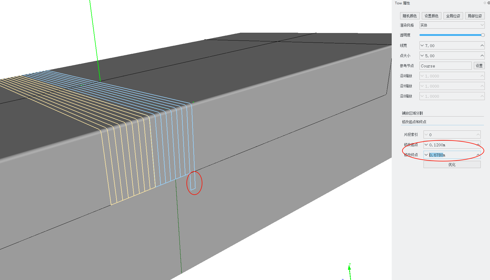

# Tow Properties

Find the prepreg tow node you want to modify in the scene tree and double-click to open its attribute editor.

## Placement Area Partitioning

Partition the placement area using the centerline, left boundary line, and right boundary line of the prepreg tow.

1. Select the boundary line of the placement area to be partitioned; it must be a closed curve.
2. Select which feature line of the prepreg tow to use: centerline, left boundary line, or right boundary line.
3. Click the `Partition` button.

The calculation results can be viewed in the scene tree.

## Modify Start and End Points

After the prepreg tow planning is complete, individual prepreg tows can be extended or shortened. The operation is shown in the figure below:

- Segment Index: On a placement surface with defined hole boundaries, a single prepreg tow may contain multiple segments of tows. This specifies which tow segment to modify.
- Modify Start Point: Modifies the start point of the tow segment. This value is the arc length distance from the start point to the start point of the reference centerline. To extend by 0.1m, decrease this value by 0.1; otherwise, increase it.
- Modify End Point: Modifies the end point of the tow segment. This value is the arc length distance from the end point to the start point of the reference centerline. To extend by 0.1m, increase this value by 0.1; otherwise, decrease it.
- Optimize: In some cases, extending a segment of tow may cause adjacent segments to overlap. Clicking Optimize will merge adjacent overlapping tow segments.
