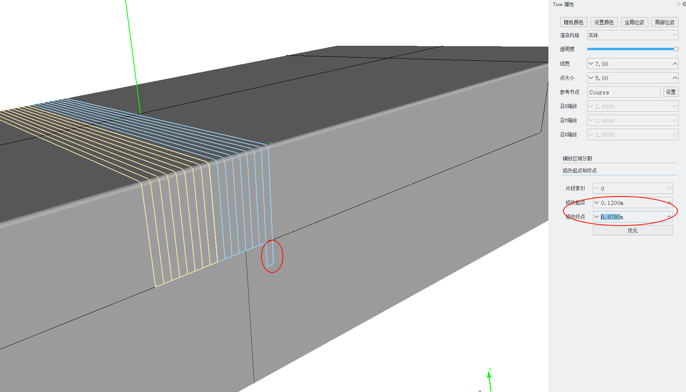

# Tow Properties

Find the prepreg tow node you want to modify in the scene tree and double-click to open its property editor.

## Length

Displays the total length of the tow (in meters).

## Segment

On a placement surface with defined hole boundaries, a single prepreg tow may contain multiple segments of tows. This specifies which tow segment to modify.

## Modify Head

Modifies the start point of the current segment. This value is the arc length distance from the start point to the start point of the reference centerline (in meters). To extend by 0.1m, decrease this value by 0.1; otherwise, increase it.

## Modify Tail

Modifies the end point of the current segment. This value is the arc length distance from the end point to the start point of the reference centerline (in meters). To extend by 0.1m, increase this value by 0.1; otherwise, decrease it.

The operations of modifying the start and end points are shown in the figure below:

## Refine

In some cases, extending a segment of tow may cause adjacent segments to overlap. Clicking **Refine** will merge adjacent overlapping tow segments.

## Delete Segment

Deletes the current segment. A confirmation dialog is shown before deletion, and the deletion cannot be undone; each tow must keep at least one segment.

## Display

The display properties of a tow node can be edited in the scene-tree property editor:

- Show Tow Mesh: Controls the mesh display of an individual tow. A ply node can also control the mesh display of its child tows; when the child follows the ply setting, change visibility at the ply level first.
- Show Center Line: Controls the display of the tow's centerline.
- Show Boundary Line: Controls the display of the tow's left and right boundary lines.
- Show Direction: Controls the display of the direction arrows on the tow path.

A tow node also supports the following actions:

- Extract Left Boundary Curve / Extract Center Curve / Extract Right Boundary Curve: Extracts the tow's left boundary line, centerline, or right boundary line as an independent curve node.
