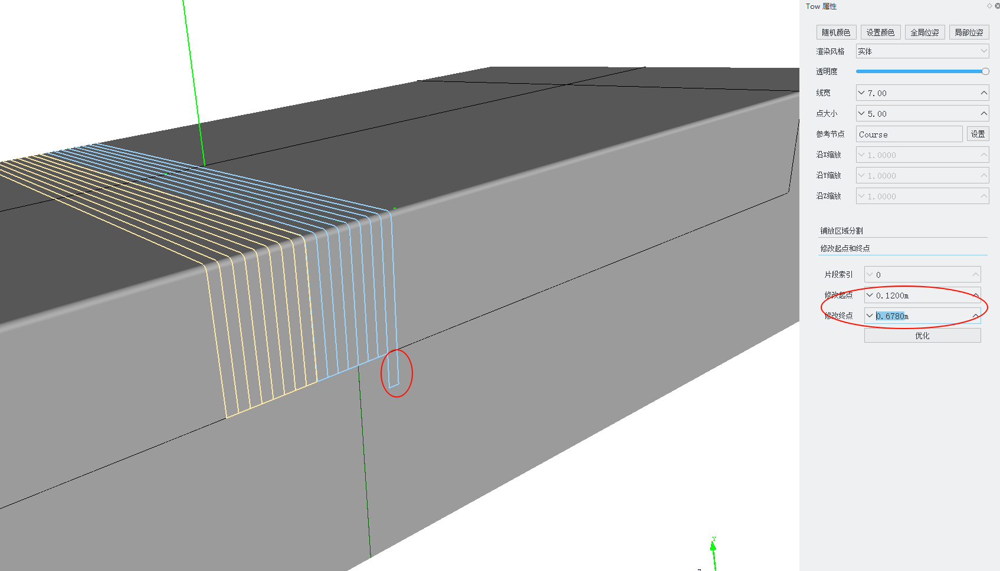

# 丝束(Tow)属性

在场景树中找到要修改属性的预浸带节点，双击打开其属性编辑面板。

## 铺放区域分割

使用预浸带的中心线、左边界线、右边界线将铺放区域进行分割。

1. 选择要分割的铺放区域的边界线，必须是封闭的曲线；
2. 选择使用预浸带的哪种特征线：中心线、左边界线、右边界线;
3. 点击`分割`按钮；

计算结果在场景树中可以查看。

## 修改起点与终点

在预浸带已经规划完成后，可以对单根预浸带进行延长或者缩短，操作如下图所示：

- 片段索引：在定义了孔洞边界的铺放曲面上，一条预浸带会包含多段丝束，这里用来指定修改哪一段丝束
- 修改起点：修改丝束起点，该值是起点距离参考中心线起点的弧长距离，如要延长0.1m，将该值减少0.1，否则，反之
- 修改终点：修改丝束终点，该值是终点距离参考中心线起点的弧长距离，如要延长0.1m，将该值增加0.1，否则，反之
- 优化：在某些情况下，延长了一段丝束后，可能导致相邻的丝束互相重叠，点击优化后，可以将相邻的重叠丝束进行合并。