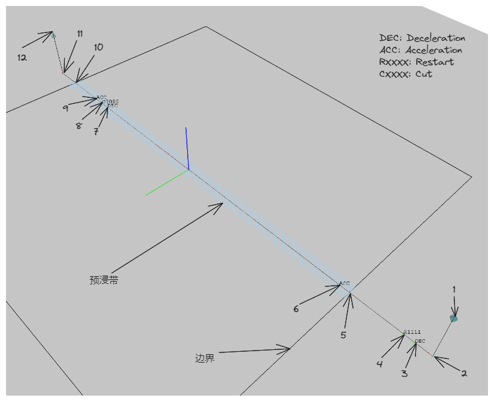
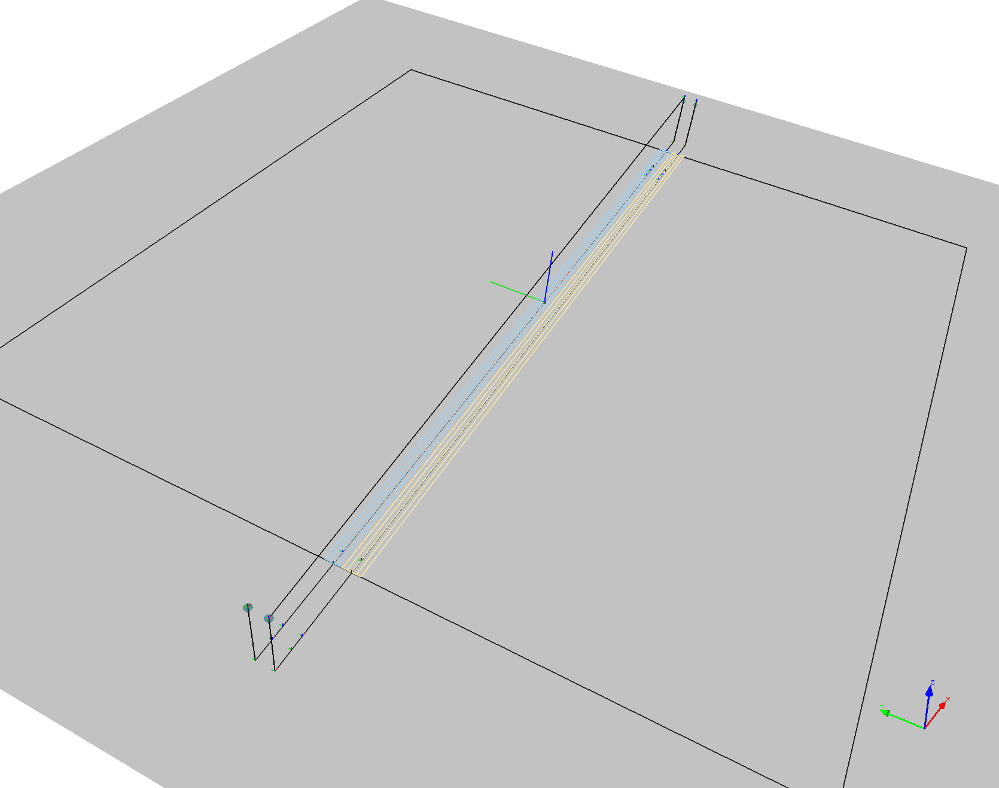
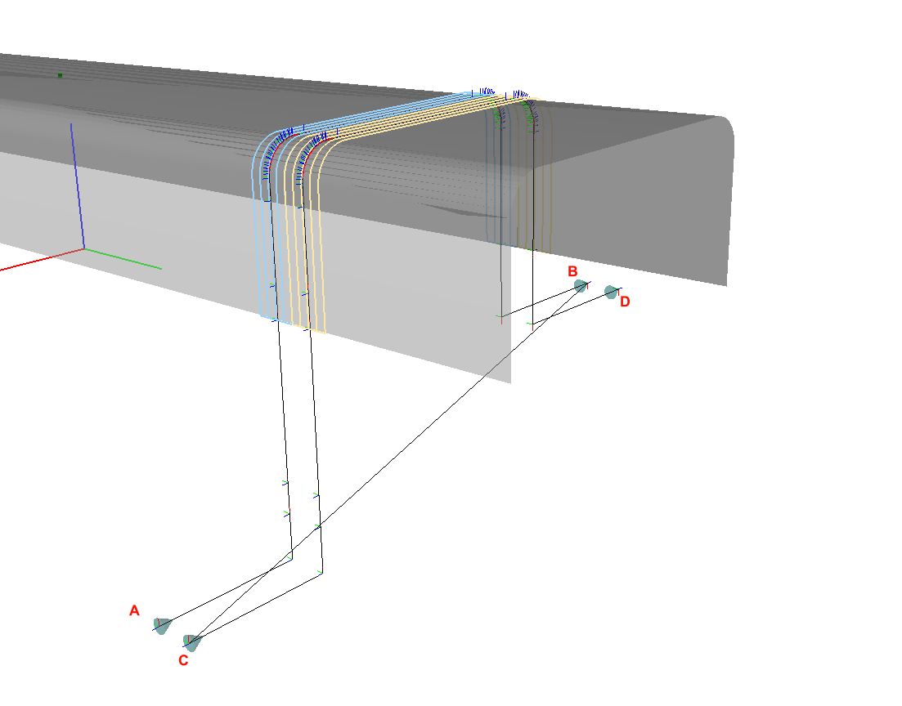
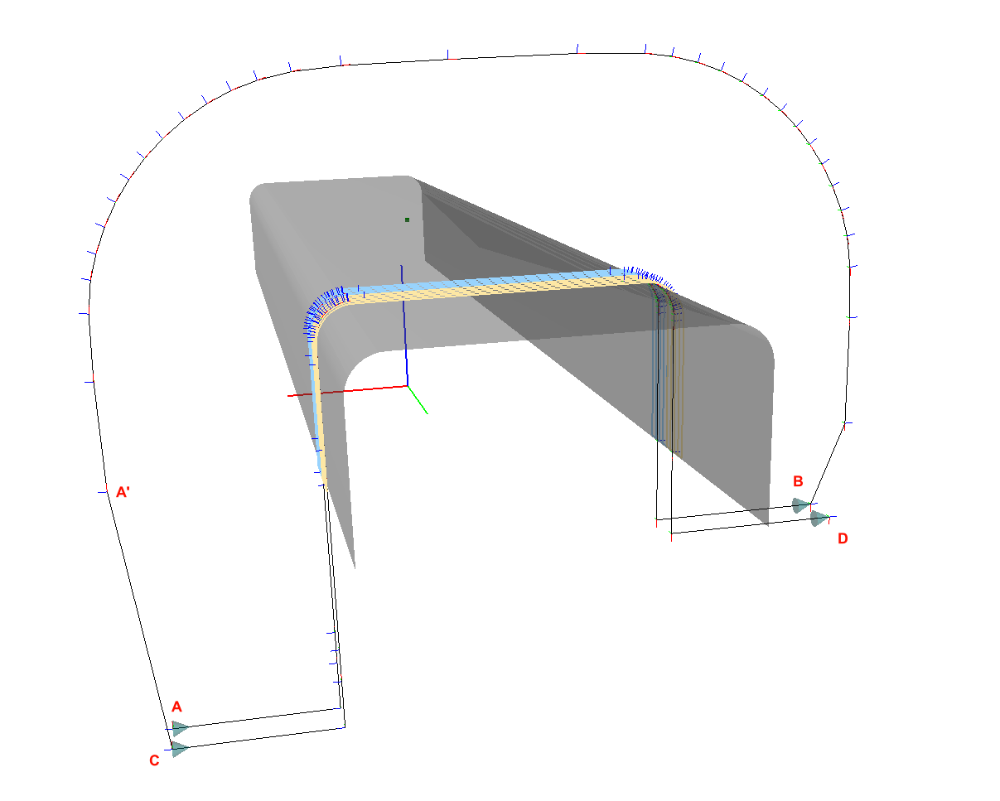
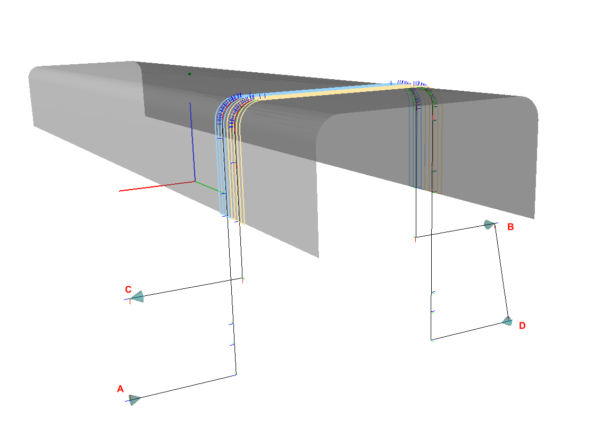
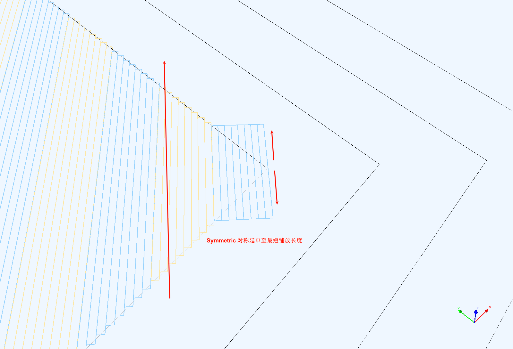
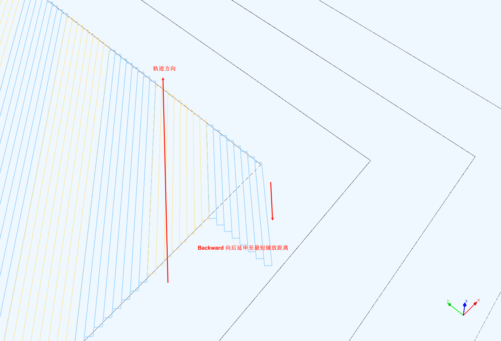
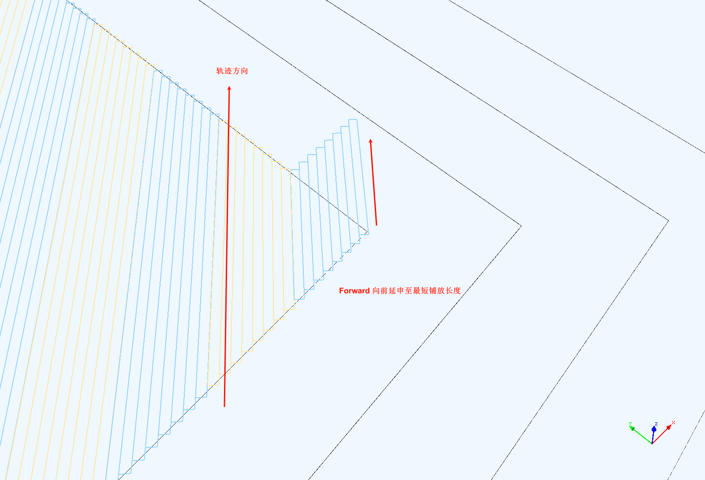

# Ply Planning Parameters

## Placement Path Definition

To explain the ply parameters more intuitively, let's take a single path placed on a flat plate as an example to illustrate some key parameters:

Points 1-12 in the figure define the key points of a typical placement head path. The interval between two key points is a key interval, and there are parameters for the distance and speed of different intervals.

### Key Point Definitions
- 1: Approach point to the mandrel surface, also the path start point;
- 2: Contact point with the mandrel surface;
- 3: Deceleration point;
- 4: Restart point, the number following the 'R' indicates the prepreg tow to be restarted;
- 5: Entry into the placement area boundary (PlyStartBoundary);
- 6: Acceleration point, high-speed regular placement begins after the roller presses the tow;
- 7: Deceleration point, approaching the cutting position, low-speed placement begins;
- 8: Cutting point, the number following the 'C' indicates the prepreg tow to be cut;
- 9: Acceleration point, high-speed regular placement resumes after cutting;
- 10: Exit from the placement area boundary (PlyEndBoundary);
- 11: Detach point, preparing to leave the mandrel surface;
- 12: Departure point, a certain distance above the mandrel surface, also the endpoint of this path;

The positions of the above key points are calculated from the parameters given in the `Range Definitions` below.

### Range Definitions {#range-definition}
- 1-2, 11-12: Endpoint Lift Distance;
- 2-4: Lead Distance;
- 4-5: Restart Distance;
- 8-10: Cutting Distance;
- 3-4, 5-6, 7-8, 8-9: Restart/Cutting speed control range;

!!! attention "Attention"
    The Restart/Cutting speed control range should be less than the 2-4 Lead Distance and the 8-10 Cutting Distance.

- 10-11: Lag Distance;

### Speed Definitions
- Restart Speed: Speed in the 3-6 and 7-9 intervals;
- Placement Speed: Speed in the 6-7 and 9-11 intervals;
- Idle Speed: Speed in all other intervals (1-3, 11-12, etc.);

## Path Linking Strategy {#link-path-policy}

The centerline of each set of prepreg tows is its placement path (also known as the Head Path). How to calculate the transition path between the endpoint of the previous set of placement paths and the start point of the next set is the problem that the path linking strategy aims to solve. Three strategies are built into the software.

#### Straight

Under this strategy, the endpoint of the previous path and the start point of the next path are connected by a straight line.

This strategy is simple to calculate and maximizes robot movement performance, but it is only suitable for flat surfaces; otherwise, the transition path may collide with the model.

#### Reverse Head Path

Under this strategy, after the placement head reaches the endpoint of the path, the placement path just completed is reversed and offset a certain distance in the surface normal direction (this distance is defined by `Post-processing Parameters/Idle Lift Distance`) to generate a transition connection path parallel to the original placement path. Sampling is performed on this path at given intervals (defined by `Post-processing Parameters/Idle Path Point Distance`) until the position near the start point of the next set of placement paths is reached, and then movement occurs via linear interpolation.

The following example assumes `A-B` and `C-D` are adjacent sets of placement head paths.

In the above image, using the `Straight` strategy results in the path `A-B-C-D`, causing the transition path to pass straight through the underside of the beam (**B-C** segment), inevitably leading to collision.

In the above image, using `ReverseCurrentHeadPath`, the path is `A-B-A'-C-D`. The transition path will first reverse along the placement path of the beam (**B-A'** segment) and then move to the start point of the next set of paths (**A'-C** segment).

This strategy is suitable for 90-degree and ±45-degree placement paths on rotary parts.

#### Bidirectional Placement

Both `Straight` and `ReverseCurrentHeadPath` are restricted by the constraint that the placement head can only perform *unidirectional placement*. If the placement head can perform **bidirectional placement**, the `ReverseNextHeadPath` link strategy should be used. This strategy reverses the next set of placement paths. Generally, this makes the endpoint of the previous set and the start point of the next set close enough in spatial position to connect with a straight line.

In bidirectional placement, the path is `A-B-D-C`, the transition path is `B-D`. The original direction of the next path would have been `C-D`, but it is reversed to `D-C`, thereby achieving bidirectional placement.

Using bidirectional placement can improve efficiency, but the placement equipment must have corresponding functions and requires high motion precision.

## Parameter Descriptions

!!! note
    Units for length in FiberArt are unified as **meters (m)**.

### Material
- Prepreg Width: The width of the prepreg (Tow), a typical value is 0.0064m (1/4 inch);
- Prepreg Thickness: The thickness of the prepreg;
- Minimum Steering Radius: The minimum steering radius for prepreg placement in plane bending;

### Placement Head
- Maximum Number of Tows: The maximum number of prepreg tows that the placement head can place in one course, typical values are 4, 8, 16, 32, etc.;
- Restart Distance: See [Range Definitions](#range-definition)
- Cutting Distance: See [Range Definitions](#range-definition)
- Minimum Placement Distance: The shortest prepreg tow length the placement head can place, usually close to the restart and cutting distances;
- Roller Radius: The radius of the placement head roller;
- Maximum Roller Deformation: The maximum deformation of the placement head roller;

### Planner
- Planned Number of Tows: The number of prepreg tows planned for each course;

!!! attention "Attention"
    **Planned Number of Tows** must be less than or equal to **Maximum Number of Tows** of the placement head.

- Lead Distance: See [Range Definitions](#range-definition)
- Lag Distance: See [Range Definitions](#range-definition)
- Lift Distance: See [Range Definitions](#range-definition)
- Minimum Gap Length: The minimum distance between two adjacent segments of a prepreg tow; segments closer than this distance will be merged to avoid frequent cutting and restarting.
- Restart/Cutting Speed Control Range: See [Range Definitions](#range-definition)
- Overlap: The overlap method for adjacent courses;
    - No: Overlap is not allowed; adjacent courses will not overlap, but gaps may be larger.
    - Half: Half-overlap; adjacent boundary tows are allowed to overlap until the overlap distance exceeds half the width of the tow.
    - Full: Full-overlap; adjacent boundary tows are allowed to overlap until the overlap distance exceeds the width of the tow.
    - Ignore: Adjacent boundary tow overlap is not calculated; only the placement area boundary is used for trimming.
- Minimum Path Extension Strategy: When calculating trajectories in 45-degree directions at corners, the length of the tow within the boundary often fails to reach the minimum placement distance. In such cases, the tow needs to be extended:
    - Symmetric: Symmetrical extension at both ends, this is the default option.
    

    - Backward: Extension in the opposite direction of the trajectory.
    

    - Forward: Extension in the direction of the trajectory.
     

- Trajectory Direction Error: When planning with a fixed angle algorithm, the range within which the path direction is allowed to deviate from the given direction, allowing some paths to directly use the offset algorithm to reduce gaps and overlaps.
- Adjacent Course Gap: The gap between two adjacent sets of prepreg tows.

!!! note 
    Theoretically, adjacent courses are right next to each other, but introducing a small gap helps implement different overlap strategies. This gap is usually small enough (e.g., 0.1mm) that it won't cause defects in the actual layup.

- Guide Curve Fixed Angle Step: The distance between sampling points on the guide curve.
- Trimming New Course with Left Boundary: Whether to calculate the intersection points between the newly planned ply course and the left boundary of the ply. If it's certain there are no intersection points, this can be set to false to speed up calculations.
- Trimming New Course with Right Boundary: Whether to calculate the intersection points between the newly planned ply course and the right boundary of the ply.
- Show Reference Line for Each Course: During planning, display the reference centerline of each prepreg course in real-time.
- Show Reference Line for Each Tow: During planning, display the reference lines for the boundaries and centerline of each prepreg tow in real-time.

### Post-processing Parameters
- Path Linking Strategy: Refer to [Path Linking Strategy](#link-path-policy). This parameter is set in the ply's attribute interface.
- Transverse Layup Direction: Whether to place from left to right or right to left when generating a transition path.
- Longitudinal Layup Direction: Whether to reverse the planned placement path direction.
- Restart Speed: The linear speed of the placement head in the restart segment, mm/min;
- Placement Speed: The linear speed of the placement head during normal placement, mm/min;
- Idle Speed: The linear speed of the placement head during transition trajectories, mm/min;
- Adjacent Point Distance: The sampling interval on the placement path;
- Transition Path Lift Distance: The distance of points on the transition path relative to the placement surface; this is not used when using the envelope surface link strategy.
- Include Original Path Key Points: Whether to include the intersection points between the path and the mesh edges.
- Invert Normal: Invert the normal direction of the points.
- Smoothness Iterations for Transition Path: The number of second-order Bézier smoothing operations performed on the transition path. Higher values result in smoother transition paths, thereby improving robot motion performance.

### Advanced Parameters

!!! attention "Attention"
    The following parameters are either infrequently used or not recommended for modification by general users (unless you precisely understand the meaning of the parameter).

- Positional Accuracy: The minimum distance between two spatial points; below this value, two spatial points are considered identical.
- Positional Accuracy (Orientation): The accuracy range for determining whether orientations are the same.
- 3D Path Intersection Accuracy: Calculation accuracy for the intersection points of two spatial paths.
- 2D Path Intersection Accuracy: Calculation accuracy for the intersection points of two planar paths.
- Minimum Distance between Adjacent Intersections: The minimum distance between two adjacent intersection points; below this value, they are considered identical. Setting this value reasonably can improve planning accuracy.
- Minimum Length of Intersecting Curves: When two curves intersect, they are subdivided; this is the minimum length of the subdivided curves.
- Reference Line Calculation Step: Sampling step on the existing boundary when calculating the reference line.
- Initial Reference Line Max Length: The maximum length of the initial reference line. If the reference line is found not to extend out of the boundary, this value can be increased.
- Orthogonal Curve Algorithm: Method for calculating a curve at a point on a curve within a surface that is orthogonal to (perpendicular to) the tangent direction at that point:
    * TracingGeodesic: Natural curve method.
    * FixedAngleGeodesic: Fixed angle method.
    * OrthogonalPlaneSection: Calculated from the intersection of the normal plane and the surface.

- 3D Path Intersection Algorithm: Method for calculating intersections of curves within a surface:
    - Project: Projection calculation.
    - Direct: Direct calculation.

- Curve Offset Step: Interval of sampling points during curve offsetting.
- Max Extension after Offset: The maximum extension length at both ends after curve offsetting.
- Max Single Offset Distance: The maximum offset amount along the orthogonal curve in one pass; using a smaller value can avoid self-intersection problems in the offset curve.
- Max Orthogonal Curve Length during Reference Line Calculation: The maximum length of the orthogonal curve when calculating the next reference line, in units of the width of one course of tows.

## How to Modify Ply Parameters {#how-to-modify-ply-parameters}

Each individual ply saves its own independent set of parameters. To modify a ply's parameters:

- Right-click the ply in the scene tree and select "Node Operation/Modify Parameters" from the popup menu.
- Double-click the ply to open its attribute panel. Under the **Ply Parameters** panel, click **Modify More Parameters** to edit in the popup interface.
- If planning is in progress, you can also click the **Modify Ply Parameters** button in the planner.

The title bar of the ply parameter editing interface will display which ply the current parameters belong to. If there is no ply, it shows that the **Default Ply Parameters** are being edited.

When creating a new ply, it copies a set of parameters from the current ply parameter editor.
