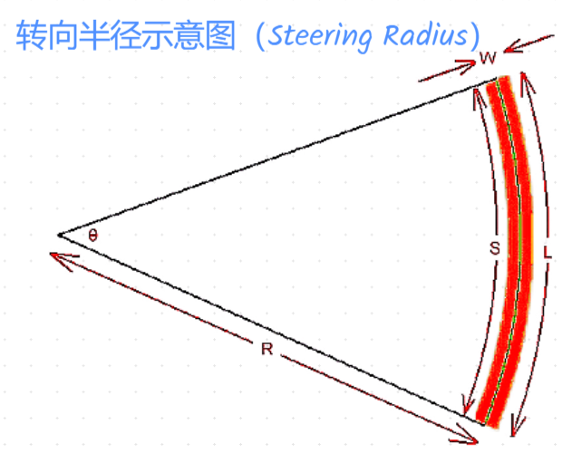
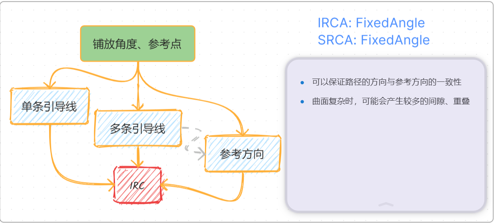
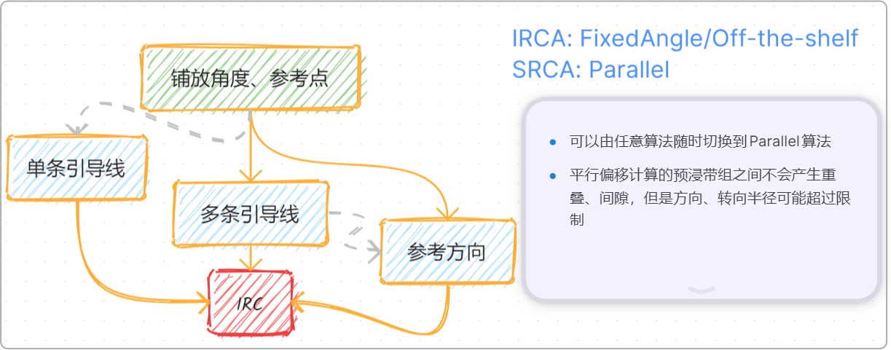
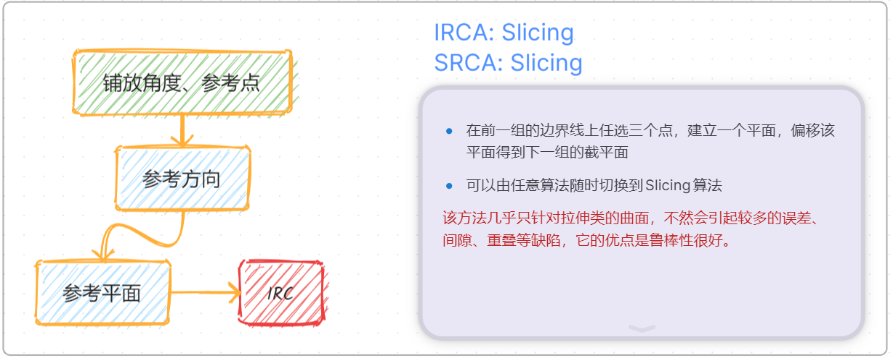
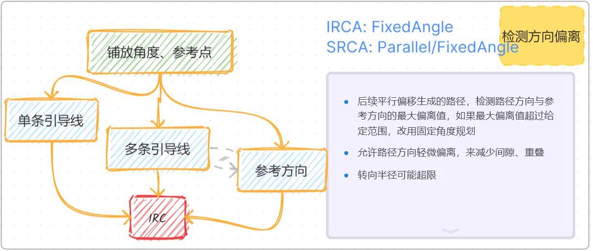
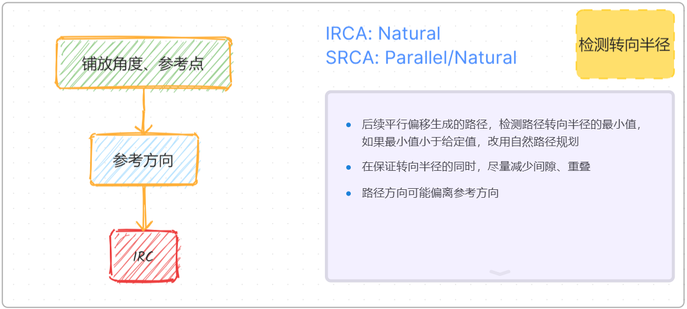

# Ply Planner

## Brief Description of the Ply Planner Interface

- Planning Algorithm: Select which planning algorithm to use. More detailed explanations are provided below.
- Trajectory Angle: The angle between the placement trajectory direction and the reference direction.
- Set Placement Surface: Select a surface node from the scene tree and click this button to set the surface to be placed. Selectable nodes are surfaces or Meshes.
- Set Reference Direction: Select a line segment node from the scene tree and click this button to set the reference direction for the path.
- Set Reference Point: Select a point node from the scene tree and click this button to set the starting point for path planning.
- Set Ply: When the `New Ply` checkbox is not checked, you can select an existing ply from the scene tree to continue planning. Related reference surfaces, reference directions, boundaries, etc., will be read from that ply and overwrite existing settings.
- New Ply: Create a new ply.
- Boundary: The boundary line of the placement area.
- Guide Curve: Guide curves for the path, which can be none, one, or several.
- Guide Curve Parameters: Additional parameter options for multiple guide curves.
    - Use single guide curve as IRC: If there is only one guide curve, you can check this option to use the guide curve directly as the initial reference curve. Subsequent prepreg tows will all be generated by offset curves from this guide curve.
- Auto-select: In the imported scene, the BFS (Breadth First Search) algorithm is used to find the first Mesh, line segment, and point to serve as the corresponding placement surface, reference direction, and reference point.
- Reset: Clear reference direction, point, and other settings.
- New Planner: Constructs a new planner based on given parameters such as the planning algorithm, trajectory angle, reference direction, reference point, boundary, guide curves, etc. Any changes to these parameters require creating a new planner for them to take effect.
- Modify Ply Parameters: After creating a planner, you can modify the ply planning parameters of the corresponding ply. Refer to [How to Modify Ply Parameters](./plan_parameters.md#how-to-modify-ply-parameters).

## Explanation of Some Terms

To help users understand how to select an appropriate planning algorithm, some simple explanations of relevant concepts are provided.

- Natural Curve: A curve formed when a prepreg tow naturally fits onto a surface, with a steering radius approaching infinity.
- Guide Curve: A curve attached to a surface that provides a directional reference for trajectory planning.
- Steering Radius: The curvature of the centerline caused by the prepreg tow steering left or right during placement. This curvature radius is the steering radius.

The software uses the following algorithm to calculate the steering radius:

$$
\begin{aligned}
L &= (R + \frac {W}{2}) \cdot \theta \\
S &= (R - \frac {W}{2}) \cdot \theta
\\ \implies 
R &= \frac {W\cdot(L + S)}{2\cdot(L-S)}
\end{aligned}
$$

- Trajectory Angle: In the tangent plane of any point on the prepreg tow centerline path, project the reference direction onto this plane. The angle between the projection vector and the tangent vector at that point is the trajectory angle.

## Reference Curve (RC)
A reference curve refers to the centerline of a set of prepreg tows. Parallelly offsetting this centerline yields the boundary lines for other prepreg tows within the set.

### Initial Reference Curve (IRC)
The initial reference curve refers to the reference curve of the first course of prepreg tows to be planned when planning the paths for a ply.

### Initial Reference Curve Algorithm (IRCA)

The calculation of the reference curve is related to multiple parameters. Based on the input parameters, it can be categorized into the following types:

#### Undefined Guide Curves

In this case, a reference point, reference direction, and placement angle must be defined. Algorithms to calculate the IRC include:

- FixedAngle: The calculated reference curve has no deviation in the placement direction, but its steering radius may be smaller than the minimum value.
- Natural: The steering radius at all points of the calculated reference curve tends toward infinity, but its direction may deviate from the placement direction.
- Slicing: A section plane is calculated based on given parameters, and the intersection line of the section plane and the surface is used as the IRC.

#### Defined Guide Curves

##### Single Guide Curve
Only one guide curve is specified. Two algorithms for IRC exist:

- Off-the-shelf: Directly use the existing guide curve as the IRC.
- FixedAngle: A reference point and placement angle need to be defined. The direction of each point on the calculated IRC is the same as the direction of the nearest point on the guide curve.

##### Multiple Guide Curves
Multiple guide curves are defined. FixedAngle is used to calculate the IRC. A reference point and placement angle must be specified simultaneously. The direction of each point on the calculated IRC is a weighted value of the directions of the points on each guide curve nearest to that point.

### Subsequent Reference Curve Algorithm (SRCA)

To calculate the reference curves for other courses, the following can be used:

- Parallel: Parallelly offset the boundary line of the previous course to obtain the reference curve for the current course. The offset distance is half the width of one prepreg course.
- FixedAngle: Similar to IRCA.
- Natural: Similar to IRCA.
- Slicing: Similar to IRCA.

## Explanation of Planning Algorithms

With the above concepts in mind, different planning algorithms are simply different combinations of **IRCA** and **SRCA**.

- Fixed Angle

- Parallel Offset

- Natural Curve: Similar to the Fixed Angle algorithm, but it first attempts to use Parallel Offset for each calculation. If a steering radius that is too small is detected, it switches to the Natural Curve method for recalculation.

- Slicing

- Fixed Angle - Parallel Offset

- Natural Curve - Parallel Offset

