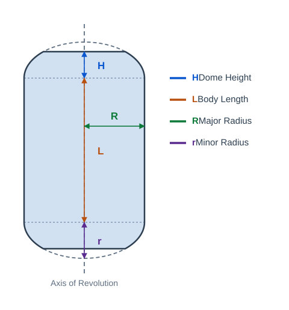

# Filament Winding

The Filament Winding module plans winding paths on axisymmetric bodies of revolution (such as pressure vessels and gas storage tanks). Currently, only axisymmetric surfaces of revolution are supported.

Show or hide the winding panel from the **Functions > Filament Winding** menu, and create a winding mandrel node from the **Model > Winding Mandrel** menu.

## 1. Creating a Winding Mandrel

Click **Model > Winding Mandrel** to create a winding mandrel node. The mandrel is a body of revolution composed of a cylindrical body section in the middle and elliptical dome sections at both ends. The revolution axis is aligned with the Z axis, as illustrated below:

Mandrel node properties (edited in the node property panel):

- Body Length: The length of the cylindrical body section.
- Dome Height: The height of the elliptical domes at both ends.
- Major Radius: The major radius of the dome ellipses, i.e. the radius of the body section.
- Minor Radius: The minor radius of the dome ellipses.

The mandrel geometry updates in real time when parameters change. Note that the minor radius must not exceed the major radius, and the dome height must not exceed the minor radius.

## 2. Setting the Mandrel and Winding Parameters

Set the following parameters in the winding panel:

- Mandrel: Select a mandrel node in the scene and click **Set** to fill in its node path; the path can also be typed directly into the edit box.
- Friction: The maximum friction coefficient required for the tow to stay in place on the mandrel surface without slipping. Default 0.3.
- Winding Angle: The target winding angle (angle to the revolution axis). Default 10°.
- Angle Tolerance: The allowed angular deviation when searching for feasible winding patterns. Default 1°.
- Tow Width: The width of a single tow. Default 6.4 mm.
- Winding Layers: The number of layers to wind. Default 1.

## 3. Computing the Winding Path

After setting the parameters, click **Compute**. The software searches for feasible integer winding patterns near the target angle and lists the results in the table:

- Pattern: The winding pattern expressed as `p/s/k/nd`.
- Phase Error: The difference between the actual winding cycle phase and the phase required by the pattern.
- Angle Error: The difference between the actual winding angle and the target angle.
- Friction: The maximum friction coefficient required by the tow for this pattern.

After the search finishes, the software automatically generates a winding ply node using the first pattern in the table. Double-clicking any row generates a winding ply with the corresponding pattern. If no feasible pattern is found, an error dialog appears; try adjusting the winding angle, tolerance, or friction coefficient.

## 4. Winding Ply Node

The generated winding ply node (e.g. `WindingPly 10°`) is a trajectory node and can be used directly in simulation and post-processing.

Winding ply node properties (edited in the node property panel):

- Show Tow Strip Mesh: Shows the tow strip mesh.
- Show Tow Boundary Lines: Shows the boundary lines of the wound tows.
- Show Simulation Strip Mesh: Shows the strip mesh during simulation.

The pose of each point along the path is computed on the mandrel surface by the winding algorithm. Double-click the node to inspect its path and poses.
