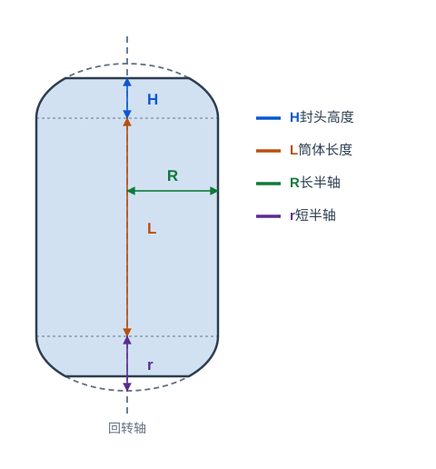

# 纤维缠绕

纤维缠绕（Filament Winding）模块用于对轴对称回转体（如压力容器、储气罐等）进行缠绕路径规划。目前仅支持轴对称回转面。

在 **功能 > 纤维缠绕** 菜单中显示或隐藏缠绕面板，在 **模型 > 缠绕芯模** 菜单中创建缠绕芯模节点。

## 1. 创建缠绕芯模

点击 **模型 > 缠绕芯模** 创建一个缠绕芯模节点。芯模是一个回转体，由中间的圆柱筒体段和两端的椭圆封头段组成，回转轴与 Z 轴对齐，示意图如下：

芯模节点的属性（在节点属性面板中修改）：

- 筒体长度：中间圆柱段的长度；
- 封头高度：两端椭圆封头的高度；
- 长半轴：封头椭圆的长半轴，即筒体段半径；
- 短半轴：封头椭圆的短半轴。

参数修改后芯模几何会实时更新。注意短半轴不能大于长半轴，封头高度不能大于短半轴。

## 2. 设置芯模与缠绕参数

在缠绕面板中设置以下参数：

- 芯模：选中场景中的芯模节点，点击 **设置** 填入芯模节点路径；也可以在文本框中直接填写路径；
- 摩擦系数：纱线在芯模表面不打滑所需的最大摩擦系数，默认 0.3；
- 缠绕角度：目标缠绕角度（与回转轴的夹角），默认 10°；
- 角度容差：搜索可行缠绕线型时允许的角度偏差，默认 1°；
- 丝束宽度：单根纱束的宽度，默认 6.4 mm；
- 缠绕层数：需要缠绕的层数，默认 1。

## 3. 计算缠绕路径

设置好参数后点击 **计算**。软件会在目标角度附近搜索可行的整数缠绕线型，并将结果列在表格中：

- 线型：以 `p/s/k/nd` 表示的缠绕线型；
- 相位误差：实际缠绕周期相位与线型所需相位之差；
- 角度误差：实际缠绕角度与目标角度之差；
- 摩擦系数：该线型对应的纱线所需最大摩擦系数。

搜索完成后，软件会自动使用表格第一行的线型生成一个缠绕层节点；双击表格中的任意一行，则使用该行对应的线型生成缠绕层。如果找不到可行线型，会弹出错误提示，可尝试调整缠绕角度、容差或摩擦系数。

## 4. 缠绕层节点

生成的缠绕层节点（如 `缠绕层 10°`）是轨迹类节点，可以直接参与仿真与后处理。

缠绕层节点的属性（在节点属性面板中修改）：

- 显示带状网格：显示预浸带带状网格；
- 显示边界线：显示缠绕带的边界线；
- 仿真时显示带状网格：仿真过程中显示带状网格。

节点的路径姿态由缠绕算法在芯模表面计算得到，双击节点可查看其轨迹与姿态。
